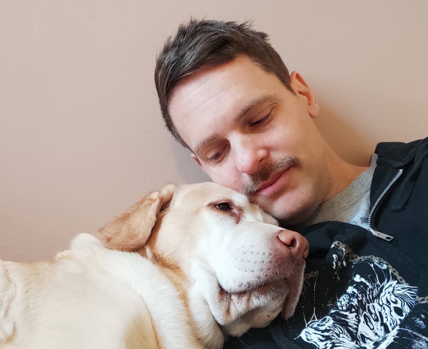

I blog on improving as a programmer.  
You can get notified on new posts via [email](https://follow.it/i-am-jonas?action=followPub) or RSS.

## Contact
Best way: [jonasl@iamjonas.me](mailto:jonasl@iamjonas.me)  
Second best way: [https://www.linkedin.com/in/jonashlundberg](https://www.linkedin.com/in/jonashlundberg)

## Resume
Fancy CV: [https://cutt.ly/QzwIRrd](https://cutt.ly/QzwIRrd)  
LinkedIn style CV: [https://www.linkedin.com/in/jonashlundberg](https://www.linkedin.com/in/jonashlundberg)  

I do consulting and freelancing.  
If you need one of those get in touch!

## Boring background
I've been coding since early 90-ies.  
I've been coding and getting [paid](https://se.linkedin.com/in/jonashlundberg) for it since mid 00-ies.  
I freelance since 2016 because I get to be my own boss.  
I call my blog-posts articles because it sounds more pompous.  
I have this one-man [melodic death metal](https://www.facebook.com/aestheticsofaloss/) orchestra.  
I've take an a blood oath to choose quality over quantity.  

