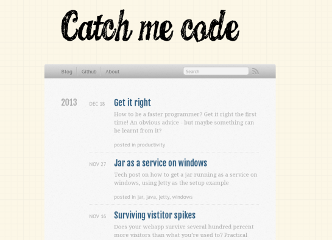

**Edit:** This is the setup of the old blog.

Old site archived [here](http://jonaslu.github.io/). Post kept for historical reasons.

Before getting on with writing posts props needs to go to the people and software that made this possible.

The background texture was found [here](http://designmoo.com/16245/technical-drawing-paper-texture/) by [pewee design](http://www.peweedesign.com/).
The header font from [here](http://www.dafont.com/candy-inc.font) by [Billy Argel](https://www.facebook.com/billyargelfonts).
This blog runs on the awesome framework [octopress](http://octopress.org/) and of lots of coffee.

The theme is an adaption by me on the default theme shipped with octopress.
