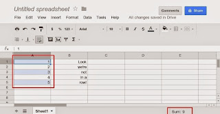

**Edit:** google has added ctrl+click to spreadsheets [a while ago](https://productforums.google.com/forum/#!topic/docs/TUltIeMntog) so this should no longer be needed.

Its here: [http://userscripts.org/scripts/show/166316](http://userscripts.org/scripts/show/166316).

Press the install button to use it. There are also instructions on the site for how to get running with greasemonkey and tampermonkey [here](http://userscripts.org/about/installing).

## Usage
Press ctrl and hold it while you click cells that contain contents that can be parsed to a number. The cells can be non-adjacent (the reason why this was made). The sum will be shown in the lower left corner. Click the selected element again to deselect it and remove it from the sum.

In use it will look like this:

## Background
I like google docs and use it for most office related stuff. Its sufficient and really only lacking some features compared to win office or libre office. But ctrl + click to sum up non adjacent cells is one of the few things excel and the likes have that I sorely missed in the google suite. So much I took the dive and made this greasemonkey script to work around it.

## Big reset
I does not in any way modifying the real contents or color of your cells so if it does get stuck somewhere and does not clean up – just refresh the page and the changes to the html will be reset. And let me know what you did so I maybe can fix it someday.

## Tech goals
My aim was stability first and an integrated look second. Almost achieved it. I tried to reuse the sum box you get with shift + mark cells, but didn’t quite make it. It kept jumping down and sometimes locking up the regular function – so I gave up, I’m guessing you need to know some of the minified javascript magic to use it full out. Also, that solution was a bit too volatile to conflict with the first goal as it relied quite heavily on using css classes to hijack the sum box element.

In addition, the sum box has other uses (and feelings m’kay?) too – it can display averages etc and I didn’t want to give the impression that this was wholly integrated to it. So in the end I went for inserting just a div under the td class docs-sheet-status-container. It doesn’t look as integrated as reusing the sum box – but I’m hoping it will be a more stable solution.

## Highlighting selected cells
The color highlighting color however was easier to get the integrated look. The background color is really done with opacity and a div overlay. This way too hard to copy, so I’m doing a mean calculation of googles overlay color rgb(8,146,247) with opacity one mixed with the original background color of the cell. It looks exactly the same but if you inspect how google does it its via overlays – I wouldn’t know the size of the cells or overlays. This is a cheaper hack.

## Selecting the value to sum
Finding the selected cell would be hard – it would be dependent on whatever way google decides is the selected class. A more reliable way was to simply bind an onclick handler on the entire window and capture whatever clicked element. This has the drawback that if you don’t click on the actual cell but on the selected border, or the small dot in the corner (all divs by the way) the div gets it – (the click that is). It should however not be a big problem, just aim at the middle and don’t set your cell size so low you cant hit it.

Anything you click will be tested if it parses as a digit and if it does – its added to the sum.

## Keep in touch
Tested in google chrome so far – please let me know if you test in other browsers if it works or not.
