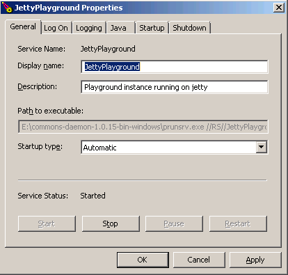
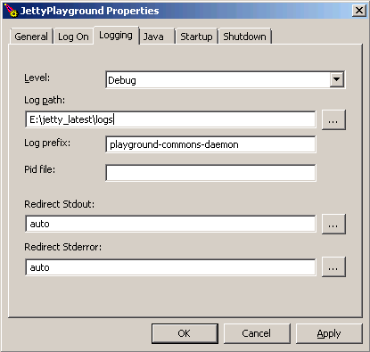
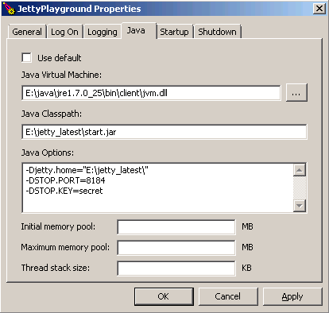
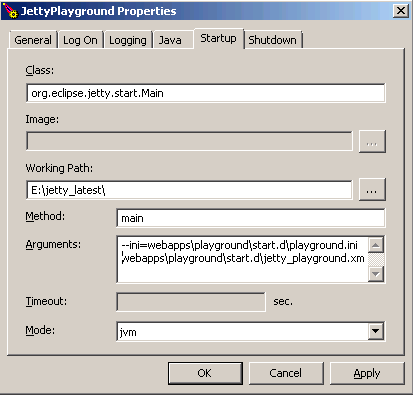
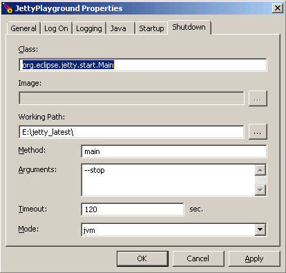

When [setting up jetty](/2013/08/jetty-multiple-instances.html) I wanted to start it with the start.jar file – since this builds some useful stuff like paths etc. I searched some for how to run a jar as a service, but came up mostly empty handed (there were some – do like this, but none found went into enough detail on what “like this” actually meant).

There are a couple of [options](http://stackoverflow.com/questions/1617458/how-to-create-windows-service-from-java-jar), but most seemed quite hack-ish. I wanted a way that could easily be reproduced on multiple machines moving from test to production environment.

## Run Procrun, run!
For this we’ll go with what the fine folks over at apache has built:
You’ll need the windows version which is not the one you’ll find on the main page download. Its found here: [http://www.apache.org/dist/commons/daemon/binaries/windows/](http://www.apache.org/dist/commons/daemon/binaries/windows/)

Extract the .zip to a folder on your disk where you remember it. The important files are the binaries in the unzipped folder – one prunsrv for managing the services command line, and one prunmgr for editing existing services in a GUI.

This post will show the GUI way, but everything can be converted to a script for easy installing on several machines.

## How many bits?
Now, before you run off installing services to the left and right, take a moment and note if you’re running a 32 or 64-bit version of windows. The prunsrv version found in the root of the commons daemon install is compatible with a 32-bit windows.

So if you’re on 64-bit you need to go into the amd64 folder one level down from the root install to find prunsrv compatible with 64-bit. If you use the wrong version to install the service it will not start.

## Installing it
Using the right version of prunsrv open up a cmd.exe and enter `prunsrv //IS//<Service name>`. This will install an empty service.

To set up the service in a GUI enter `prunmgr //ES//<Service name>`. Heres what you should see (all fields being empty at first):

## General settings

In the path to executable read only field you can spot what version you used to install the service with. If it points directly to the root install folder its the 32-bit version. If its under an amd64 subfolder to the root install – it will start the service as a 64-bit version.

The startup type controls the usual windows settings – how the service is started (manual, automatic or disabled).

The log on tab is pretty self explanatory, its what user the service will run under.

## Logging settings

The level of logging concerns the actual commons procrun service itself – it will print stuff like ‘starting service X’ and ‘stopping service X’ to the logs. It can come handy if your service restarts without you knowing it and you have to figure out why it happened.

Log prefix controls what the log file will be called. The log file is rotated daily. By setting redirect stderr and stdout to auto the jar application stdout and stderr will also be appended to their own respective logfiles in the same directory. These are also rotated daily.

When running jetty the auto does not add anything extra since jetty logs its own stdout and stderr to configurable files. But any other application that does not will be captured so it doesn’t hurt to have them set as auto.

## Java settings

I didn’t have any luck using the “Use default” setting for the JVM. I had to point out the exact dll – maybe you don’t. But If you do: you’ll need the bin\\client\\jvm.dll (or the server equivalent if you’re on 64 bit) as your virtual machine.

In the java classpath, point out the jar you want to run as a service – in this case the start.jar from jetty.
In the Java options you can send parameters to the jvm process itself. **All of these must be separated with newline**. Small gotcha that took a while to figure out.

## Startup settings

Here you point out in what class the start method resides and what its called.

The arguments are passed to your main method, note that you also need to separate these with newline here.

## Shutdown settings

Same here, what class and method to call when shutting down the service. Jetty uses the same with a command line parameter —stop to shut down the service.

An optional timeout in seconds can be set before the service is killed hard.

As said on the outset, all of these settings can also be inputted as command line parameters to the prunsrv.

## Reverting
If you do something wrong or just get tired of running services – its deleted with `prunsrv //DS//<Service name>`

## Troubleshooting
If everything goes as expected there will be some bumps before its smooth sailing.

The logs can be of help, also useful for getting more error messages on why it did not start is running it first via the console `prunsrv //TS//<ServiceName>` – it will hopefully output something you can google on.

## Didn’t happen!
What’s remarkable is how hard it is to write a large post on windows and not even once mention that I pity for you being stuck on Windows! I’m maturing!
