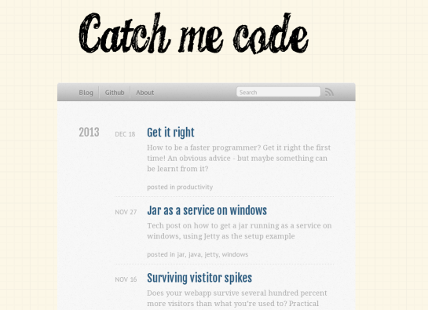

**Finally!** The blog is back up after more than ½ a year of hiatus. Its been a rough spring with lots of personal stuff going on in my life and so the blog had to take a backseat for some time. Bringing it back to life there has been some major changes:

## Octopress -> Blogger
If you look at the post frequency it declined during the year the blog was active. This was in part the tools - I'm sure the decline had not been as steep if the tools were more fitting. It became evident that I had to change lest my interest would dwindle.

I spend a fair amount of time researching what to change to. My first reaction was another static site generator but with less pain of setting up, customizing and less complicated workflow.

But thinking it through some more - a lot of the slowdowns were also related to the use of a static site generator as such - dealing with files in the shape of drafts, post sources, generated site and deploying it somewhere.

## Whats wrong with octopress?
*   Complicated workflow
*   Complicated feedback loop
*   Ruby / sass / markdown / erb templates (complicated setup)

Mind you these are **my** reasons - add an IMHO before each point should you feel the need to defend something. Should you feel the need to clarify something on the other hand - leave a comment. Now - lets break it down and motivate these a bit:

## Getting drafts in place
Ideas for posts come at anytime, most often not near a terminal with the blog installed. So I'd type up the draft in either a browser or some text editor using dropbox. Work on it until it reached an ok state, then [create a post in the blog source folder](http://octopress.org/docs/blogging/) - copy the text from the draft. Remember to delete the draft (because if you forgot there now were two versions of the draft with conflicting content) and work on it until a post was done.

Once the draft was morphed into a source post it was gone from iterating. Since the octopress install is on a physical machine you need access to that machine containing the source folder. So no backing off from the post (save you delete it from the source folder and de-mote it to a draft again).

There are some workarounds I guess. You could use git for cloning your blog using branches to store drafts - iterating on drafts on other machines. But then you need to remember to push back to wherever the main repo was and solving merge conflicts for your drafts. Ugh.

Or you could somehow symlink dropbox (or some fileshare) into the octopress install on one machine and edit the drafts in the fileshare on other machines. But still far from ideal.

## Typesetting and spell checking
After a post matured beyond a draft into a real post there was the issue of typesetting the post. Posts should be easy on the eyes. Just the same way a nice typesetting of code makes it easier to read. Paragraphs need to be balanced in length with plenty of whitespace / air in between them.

In octopress you had to write the post, start preview, hit up a browser, inspect it, go back and find the sections that needed modification. Back and forth between the terminal and browser with the occasional rebuild of the entire site in between.

I'll admit it. I really longed for a [wysiwyg](http://en.wikipedia.org/wiki/WYSIWYG) editor (I'm writing this in one now, oh joy!). As long as you work with them and make the final touches on the html should you need it they're not that bad.

The bulk of any post will be 90% text and 10% code / images / [nyancats](//www.youtube.com/watch?v=wZZ7oFKsKzY). A wysiwyg is perfect for this - get the idea out there, iterate on it and then if needed dive into the html and tweak it.

Another issue was spell checking. The browser has a fine spellchecker by default and installs easily different languages. Vim / sublime / gedit / nano does but its a pain to set up. You also need to install it on each machine you edit posts on.

## Almost done with a post
Once the post was done and the site generated and looked ok it was still the matter of publishing it. For this you had to be on the machine with the correct ssh keys. Then - remembering the ssh key password for github and finally push it.

Same problem when updating older content (fix typos, forward link to newer posts etc). Get to a terminal having access to the the actual install, find the file needing update, generate, push, publish. I guess this will snowball when content increases.

Bottom line - its very tied to actual machines and what they have installed.

## Ruby / rvm / bundler
Again this maybe says a bit about me not being a rubyist. Maybe it's a breeze for rubyists to set up. But I doubt it.

I was gobsmacked the first time setting it up which on paper [looked so easy](http://octopress.org/docs/setup/). I ran into problems that no one else seemed to have. It took hours to get up. I kid you not and I consider myself pretty used to getting obscure programs to run.

This was a major contributing factor for not choosing another static site generator. If something needs to be installed it's going to take a while - and you'll be in the mercy of your OS should it decide to release a new version of some dependency (or worse if you needed to do a [clean reinstall](http://www.catchmecode.com/2014/08/im-running-arch-linux-and-so-should-you.html)).

## Sass / markdown / erb / octopress templates
Sass and markdown seemed such a good idea - but sadly it has just fueled my weariness for [transpiled content](http://en.wikipedia.org/wiki/Source-to-source_compiler) (yet another post there). Quite soon I ran into things that were [not handled](http://daringfireball.net/projects/markdown/syntax#html) so nicely by markdown like tables. You had to drop down to html anyway.

[Customizing](http://octopress.org/docs/theme/template/) or adding stuff that weren't originally in the octopress default template also took lots of time. This again might be me now knowing all of these well enough - but checking through the template system they were put together from small fractions of templates and it was really hard telling what came from where and how.

Googling on how to customize it came up pretty empty too. It was a matter of [RTFS](http://www.internetslang.com/RTFS-meaning-definition.asp).

## But why Blogger?
Again - maybe some of this is on me. I chose a platform in a language I don't know well enough using sass and markdown which I again apparently do not know well enough. So the freedom of a static site generator was kind of lost on me anyway.

Case-in-point - lots of time spent setting up, tweaking, head scratching, working around and less time spent writing content. Maybe not so hard to figure out why after that rough barrage of critique - but here's the list of why I've moved to blogger:

*   It runs anywhere there is a browser
*   Wysiwyg editor with the wunderfül built-in browser spellchecker
*   Raw HTML view should you need to tweak something
*   Drafts!
*   Easy publishing from anywhere
*   Relatively maintenance free once its up (hopefully)

I'll go more into detail in another post on the whys. There will be a cons list too to balance it off a bit barring the most obvious points since blogger seems to be the read headed step child of all hosted platforms.

I'll also at the same time explain how to customize it with the lessons learned setting up this.

## Upwards and onwards
So in this post alone there's new topic for 2 or 3 more posts. Content spawns content - It's good to be back!

And here's an image of the [original site](http://jonaslu.github.io/) - just for the nostalgia of it

