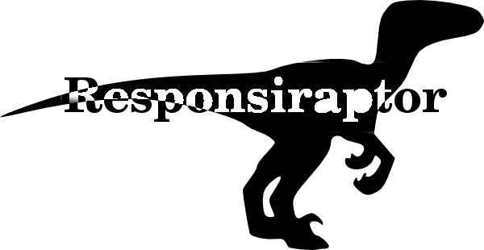

So I've decided to take the plunge and open source the template I created for this site.

This post will give a bit of background on why things were done as they were. If you are simply looking for how get it going - go to [the demo site](http://responsiraptor.blogspot.com/). There you will find where to get it, license, needed blogger settings, credits and examples.

## Background
Despite leaving octopress (and [lamenting](/2014/07/from-octopress-to-blogger.html) that choice) its design largely inspired the new layout. Blogger templates are often bloated. I think this stems from that blogger offer a lot of bells and whistles (called widgets) and that the devil hates idle hands.

Templates are expanded to accommodate all widgets - because they are there. Gotta use 'em right?

I wanted the layout to be minimalistic. More code - less waste of screenspace. That meant no archives, no tag could, no static lists with stuff, no feedroll and no rss feeds on the main page.

The mission was: One man - one column.

Navigation should be easy. Most folks are here for the code (and by mishap gets a barrage of opinions too) - so code should be easilly accessible. Hence a simple top right navigation.

And responsive! Its 2014 right? Gotta be responsive!

## Bootstrap is mobile first!
The whole html framework and responsiveness comes from the internet fame [bootstrap](http://getbootstrap.com/). A pretty easy choice - I have used bootstrap before and know its grid system well. The typography is good out of the box too.

Blogger has some kind of string magic if the site is rendered on a cell phone - called mobile view. I quickly decided not to go that route and instead build the template to fit any device using only bootstraps grid system.

Its responsive in that nice way that a single column is [responsive in itself](http://line-mode.cern.ch/www/hypertext/WWW/TheProject.html). The only thing that moves around is the blog title - the static links on the left moves below the logo. That's it. I like it in a minimalist / uncomplicated elegant solution. The less that needs to be **made**responsive the better.

## Code friendly!
Another goal was that the template should be code-friendly, so it looks pretty when I'm not rambling and actually providing examples of useful stuff. This was one of octopressstrengths - code looked and integrated nicely.

Since blogger is not static content a javascript styling library was required. The choice fell quickly and randomly on [google-code-prettify](https://code.google.com/p/google-code-prettify/). In hindsight this was mostly due to it being easy to get working.

Exchanging it for another highlighter should not be too hard.

## Huge post list
I like the front page to be like an á-la carte menu. A long-ish lists of posts with some small but tasteful synopsis to provide a quick intro whether that page is worth your time or not.

The problem was that there was no way to write content in blogger that could be displayed only on some pages. I'm abusing labels (since labels and tag could are not rendered I figured they could be used for something else) to display that short synopsis.

Ideally google would add some tag solely for this purpose - the labels hack might bite back later, but its a working workaround for now.

## Disqus
Again a legacy from octopress. I wanted comments to carry over from the old blog to the new - hence I opted to remove bloggers own and have disqus there.

Again should not be too difficult to replace it with some other commenting system (most provide pre baked javascript snippets to cut'n'paste).

## Why the name responsiraptor?
Its responsive? Velociraptors are cool? I was bored?
