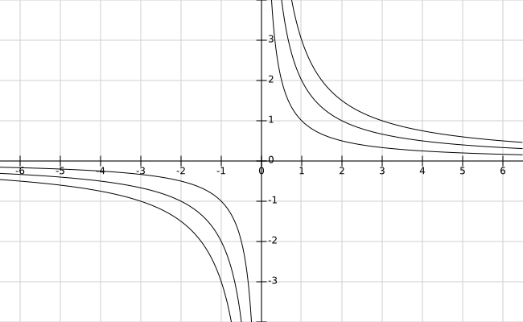

I enjoy a good rant - both as the producer and the receiver. There is often humor in a rant - and as with all jokes - there is also core of truth to it. As long as the rant is done where the guilty parties cannot hear it - i e nobody gets hurt.

As a programmer rants are pretty much part of your daily bread and butter workflow. You conjure up these fantastic devices in your head - only to see them misunderstood and possibly abused by mere mortals.

Although the ranting is useful as a vent for frustration at its core a rant are is a display of negativism. Something's wrong - hence the rant.

Negativism on a small scale is ok. Nothing is perfect (nor constant) and rants are a venting part of the change process which naturally hurts a bit.

But what is an acceptable rate of rants and what is a sign of danger? I think the rants themselves needs to be related to something else in order to put them into perspective. So - with little research or backing - I pulled this equation out of my rear:

## The rant ratio

Simple eh? The level of frustration is the relation between a rant and its solution.

Looks like this when rants is being held constant plotted against solutions on the x-axis. Also on a totally unrelated note - negative solutions give negative frustration. Hmmm... ignore that left side of the graph for your salary and sanitys sake.

On the right side - I chose an equation where I get to shout DIVISION BY ZERO!!1!!!1!! OMFG!

But hear me out - I see rants as the pathway to a solution. The ranting is even therapeutic in the way that the ranting becomes a way to better define the problem - and a proper definition of the problem is half the solution. If the solution can be achieved that is.

## The healthy ratio
The health factor to watch is if the ratio of rants to solutions is in balance. If its in balance - and it will almost at all times be above 1 and that's fine. There will be more rants than solutions because time and resources are finite.

The unhealthy part of ranting is when the rants never turn into solutions. Its becomes white elephant in the room and the frustration goes off to infinity.

## Causes of an unhealthy ratio
When the user signs up for your app there's a secret ceremony where they put ink on contracts and testify on the bible that they will do everything in their power to give unclear requirements, to abuse your applications in ways never imagined and ask stupid questions on purpose.

However considering the opposite - not having users at all - your software would be perfect but useless. So no, the problem is not the users although they get the bulk of the blame. The users are actually helping you clear up requirements in a very sobering way. They might have said that they wanted the feature X but they are clearly using it as feature Y. Part of the game - as long as you can change X into Y it's cool.

The frustration stems most often from things in your own back yard. You probably know about them but they are either of such inertia or have been forced on you that you cannot fix it. Broadly speaking they come in the form of technical debt, project restraints or dumb processes in that order.

## First and most hurtful - technical debt
First and foremost we have our old skeleton in the closet: Technical debt. It carries that guilt ribbon clearly stating that you and your colleagues helped create this mess.

Sure it might be in conspiracy with dumb processes - that time is not allocated to fix things but often that is partially up to you to flag up - and if all else fails - beef up estimates so you can fix it by moon shining. You have been playing the everything is fine game way too long and the managers love you for it. In the short run.

## Second - dumb project restraints
Most languages are Turing complete - so the language, however kludgy and inelegant it might be is not the problem either. If you are really sneaky you could write a compiler for your own personal favorite language in your forced language and switch languages so to say.

The problem is dumb constraints you cannot change so easily - frameworks, tools, OS:es on servers, legal requirements. I e not being able to use the best tool for the job.

On a high level the decisions probably makes lots of sense. Unifying processes, enabling to hire programmers en masse. The corporate machinery. But on a micro-level it can be disastrous. You probably did not partake in this decision so even if its frustrating - it probably is not your fault and is thusly free from the guilt ribbon.

## Third - dumb processes
You know them - jumping through hoops because someone said that we should have these hoops. Once they were in some part useful as few processes are introduced by sheer illwill. But many do not scale well. and quickly they are in the way if anything. Again probably nothing you asked for but imposed on you by management. By the same toke it's lower on the list because there is more leeway for skunk work.

I was once on a project where there was a [CCB](http://en.wikipedia.org/wiki/Change_control_board) which required all changes to be reviewed with an estimate on how long it would take. So the custom in the team was to make the fix, test it, then file the change request to the CCB with the estimate: 0h. I think no change request was ever stopped because they were so cheap :)

## What to do?
As always - get some gauge on where the ilk of the frustration stems from. You can even try to measure the rants. Get a whiteboard and make a tick for each topic that comes up. Tick one off if you solve something.

Then start to escalate and question things. Its the right thing to do even if its uncomfortable. You need to shine light on the problem and the frustration it's causing. Make its constructive in tone but show the problem and the consequences it has clearly.

There is a balance between crying wolf and keep on trucking - but frustration is a thing to take seriously. You are in fact lying by omission when not being open about the frustration. There is also a nice bonus "I told you so" in it when flagging up.

Its going to eat you, both in levels of stress and in the end the application itself. It or you are being used or bent in a way its not designed or accommodated to and if you keep going in that direction something is going to snap (either you or the code).
