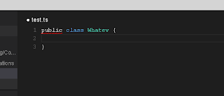

...or how we re-learned to love / tolerate javascript (in a team setting). Before ripping into this - breathe, count to 10 after every provocative statement. Then add an IMHO after every line. This is about why my team switched back - not why typescript sucks (it does not). It simply did not fit our purpose and had a high enough ROI. Yet. YMMV.

## It's not you typescript
Typescript was the knight in shining armour (a k a the silver bullet). The notion of static types makes my heart all fuzzy and warm in the cold land of "undefined is not a function". You could do safe refactorings, not having entire API method-lists in your head, symbol / method references, code completion and be sure that the string sent to you indeed was a string.

But reason for doing the switch was the module system. The js-scripts had grown up from once cute furry babies to now big hairy behemoths. 500+ lines of js-code in one file makes me nervous. Its where the party starts getting uninvited guests showing up ultimately trashing the whole ordeal.

## You're still attractive
Adding to this was the strong incentive in tooling. Typescript came with its own customized [IDE](https://code.visualstudio.com/) (with binaries for linux no less. Maybe 2015 IS the year of the linux desktop?). It supported all of the features used heavily in our Java IDE: refactoring, taking references, go to definition all done with incremental compiles so you get squiggly lines as you type (not that I ever get those).

*Squiggly line is squiggly*

Tooling is a big part of the sell for me. Simply being a statically typed language does not give you all of this - it merely enables it. The tooling has to chip in and support it as well.

## So are you definitely typed
A nice add on was the [definitions files](http://definitelytyped.org/) for other libs. In a nutshell someone spells out the typed parameters for method calls and return values for big (untyped) js-libraries using typescript.

jquery turned from an endless API-searching to a managable ctrl+ space completion (ish). This is actually possible while still writing pure javascript - so this is a keeper even if typescript itself had to go.

## But you broke the build ;(
Here's the straw that [broke the camels back](https://github.com/Microsoft/TypeScript/wiki/Breaking-Changes#typescript-16). Despite the design goal of [not causing any substantional breaking changes](https://github.com/Microsoft/TypeScript/wiki/TypeScript-Design-Goals#goals), there are breaking changes between minor versions (1.5 to 1.6).

Now I suppose we could all argue about the semantics of not causing any substantial breaking changes - and since I haven't read through what the changes actually fixed I'm not really in a position to argue whether they were wrong or right. But! There is a cost to breaking things - wrong or right.

Having breaking changes between minor versions you very easily end up in scala / python land where other libs (and your own version dependent code) is holding you back from the latest and greatest. Back when trying out scala, the libs itself pretty much dictated what scala compiler version to use (if you were so lucky that they did match only one version). IMHO this is why java has been so successful - forward compatibility between versions. You can be pretty sure that the 'ole ye lib from yesteryear will still run on future versions.

At least some heads up as a warning about future deprecation between at least one minor version would have been nice in typescript.

There is another growing list of [breaking changes](https://github.com/Microsoft/TypeScript/wiki/Breaking-Changes#typescript-17) slated for the 1.7 release. This made me antsy. Breaking backwards compatibility is nothing to take lightly - whatever good reasons there might be. Breaking it at least twice between sequential versions smells like something was made public too early. They might want to look at how [go thinks about this](https://golang.org/doc/go1compat).

## ...and it's you transpiling
One of my biggest gripes about [transpiling](https://en.wikipedia.org/wiki/Source-to-source_compiler) is the fact that you are programming in one language through another. Debugging in the browser (to add to the pain was the usual javascript minifying) from transpiled code is hard.

Now, as an astute [colleague](http://blog.christoffer.me/) of mine pointed out there are source-maps that can be used to mitigate the pain somewhat. I haven't tried this (yet). Looks promising, but I'm a bit weary of such features covering all edge cases. And all browsers we support then have to support his in order to debug stuff properly (they don't).

## ...ok, it IS you typescript. In relation to us.
Typescript was also pretty feature heavy - [mixins](http://www.typescriptlang.org/Handbook#mixins), [generics](https://golang.org/doc/faq#generics).Whenever there's abundance of features it's easy to go overboard (especially in a team setting). If you are on your own project, these things are usually not a problem. You use what you like (read: what fits your head) and let the rest be.

But when you're in a team setting this multiplies. Everyone finds their own favorite ways of doing things and thus the code readability decreases with O(n) since each new team member added to the team will bring their own style which will result in n-1 having to learn a new style of coding and the last person needs to learn n - 1 new ways.

This has to be mitigated through discipline and coding standards. I'd rather have this more builtin the language than having to specify it (with rather time-consuming discussions setting the standard).

We felt that we were clicking 'go to reference' a bit too much in typescript. I understand that these claims are a bit vague - but that was a clear sign that we were too feature heavy and hadn't stabilized a common set of features

Maybe it's just that javascript is more familiar - we have agreed on the [module pattern](http://addyosmani.com/resources/essentialjsdesignpatterns/book/#modulepatternjavascript), in combination with one gobally scoped object for all exports. It just reads more easily, but again this might have to do more with us than with typescript.

## The place for typescript?
First up is the forward compatibility. This has got to change - its just such a huge indicator that the work was rushed. Ok for small throwaway projects - not ok for production code where everything can't be scrapped and rewritten once every blue moon.

Second - when that has settled - the team and the need has to be big enough to have at least someone producing typescript code full-time. Its not a part-time job like javascript can be. Someone needs to look at the feature set and trim it. Same goes for coding-conventions and standards.

And really - this is only needed when the application is big enough that the need for static typing is much more dire than ours (even though static typing makes my heart warm) and the win using static types are greater than the pain in transpiling.

By that time the tools will probably be much more mature. There were a few glitches using visual studio code where it didn't find references across many files. Not a deal breaker, but nice if it'd was fixed by then.

## So we're back
Undefined is once again not a function, we still kind of have the issue of modules, but not as much because we took the generated js code from the ts files. So we kind of modularized the code via typescript. But the loading order matters once again. A nice experiment with some keepers. And it's not goodbye forever - its merely a TTFN.

Visual studio code will still be on my personal menu when coding in the team since it helps with javascript by inferring what it can. Also, definitely typed:s definition files since I can't be bothered with looking things up (ctrl+space and guessing at something for the win!)

I'm probably going to use typescript myself on personal projects where it can be scrapped if versions are still broken in the future.
