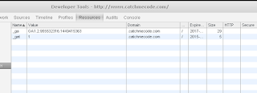
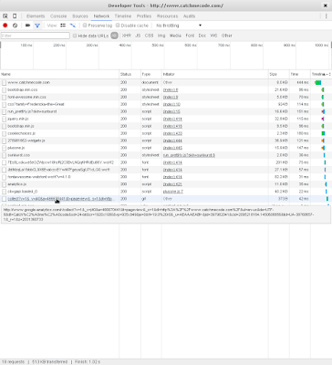
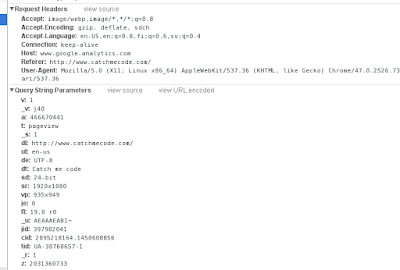

Use case: Demystify google analytics (from now on GA - to save bandwidth) enough to make the server post things into GA (in my particular case side request response roundtrip from when the request enters the server to when the request is committed to the wire - for tracking down slow pages - [akin to this](http://blog.codinghorror.com/performance-is-a-feature/)) using curl - if it works with curl you can port it into whatever language you are using (or call curl from your application if for some reason there are no http / https clients libs).

## Analytics - what is it good for?
Rich Hickey is a brilliant person and his lectures / [rants](https://youtu.be/f84n5oFoZBc?t=38s) are nuggets of (I'm guessing) experience from watching things go sour. This opening question - "If we're not solving problems - what are we doing?" nails pretty much the entire engineering profession.

So in a kind of homage to Rich whilst trying to hammer into my thick skull what great tools these questions are: WHAT PROBLEM DOES IT SOLVE? Yes, capital letters. In this case its a screaming kind of homage - you know - wind in the hair - [surfing on a crocodile](https://youtu.be/gXYfnWRp1Q0?t=1m43s).

[This post](http://www.kaushik.net/avinash/web-analytics-101-definitions-goals-metrics-kpis-dimensions-targets/#metric) gave me a good overview of what problem GA solves: it's a tool for measuring how a company performs against business goals. Yepp, I'll go wash my mouth with soap after that management-speak.

In developer-speak this means: company Acme sells dynamite via a webshop. They want to sell more dynamite (like every other company) = high level business goal. A goal is then to increase the conversion rate (number of actual checkouts / number of customers coming to the landing page of the site) of customers = low level business goal. This can then be elaborated upon by say buying ad space or doing redesigns or simplifying checkout flow.

So, it solves the problem of measuring and evaluating approaches to a goal - to sell more. Got it? Dynamite!

## Analytics - what is it?
It would be a terrible thing if marketing, management and developers had to speak the same language - you'd get crystal clear requirement specs and nothing to rant about. Goals and whatnot. Next good engineering question. WHAT ARE THE DEFINITIONS?

If you surf to GA - there is a lot of talk about sessions, dimensions and metrics. Right, those are the definitions - but WHAT DO THOSE MEAN?

## Session
When analytics.js is loaded it [places a cookie on the domain you're visiting](https://developers.google.com/analytics/devguides/collection/analyticsjs/cookie-usage#analyticsjs) - if you inspect cookies, you'll see a _ga cookie set for some shifty domain using GA to spy on you:


*Shifty site spying on you via _ga ID*

This is a session. Its a some unique id sent with each request to GA saying that it's still you viewing this page.

If you return to the same site with the same \_ga cookie present - you're a [returning visitor](https://support.google.com/analytics/answer/2731565?hl=en#time-based-expiration). This ties in nicely with a web session.

## Dimensions and metrics
This was a bit fluffy - but a dimension is anything describing the [characteristics of your users](https://support.google.com/analytics/answer/1033861?hl=en&ref_topic=2709827#Overview). Confused? Excellent. Let's move on to metrics!

Metrics are the quantitative measurement of something (about your users). Again pretty a fluffy definition.

Now, let's stand back and review this. GA produces reports. If you think about it - a report is just an aggregating query from a database. Lets muse on the following purely hypothetical scenario:

**CEO**: "Get me the sales on all A-clients for the last quarter! And a cup of black coffee!"  
**Middle-management**: "Sure thing, boss!"  
...  
**Middle-management**: "You there, whatsyourname! I need the same report for the boss as last month on A-client sales! And a cup of black coffee, stat!"  
**Developer**: "Jeez, where'd I put that query I ran a month ago.. wait here it is:
select customer, sum(sales) from big\_data\_table group by customer > report.csv;
Done. Great. Now where'd I put the laxative for the cup of coffee due stat?"

Its all rows in a table really. Dimensions as what we group rows on and metrics are row values with some value with a grouping function on it (sum, average, ratio with another metric). Pity they didn't write that instead.

It's probably all in a [big table](https://en.wikipedia.org/wiki/BigTable) google style, but since we don't have access to the data-store - what dimensions that could be combined with what metrics are a bit of a mystery.

There is [a guide](https://developers.google.com/analytics/devguides/reporting/core/dimsmets) - clicking a dimension and a metric disables others that doesn't have the same scope. But as you'll see further down, that only tells you what you can combine if google inputs the data for you. If you're on the DIY trail - it's a trial and error game.

## Lets go measurement protocol
The APIs grow tall and wild at google. There seems to be an abundance of them for accessing GA. After a while of digging I found the [measurements protocol](https://developers.google.com/analytics/devguides/collection/protocol/v1/?hl=en) which fitted nicely into the third good engineering question: HOW CAN I TEST THIS IN THE SIMPLEST POSSIBLE WAY?

curl seemed to fit that bill. About 0 seconds to spend on installing it. And awaaay we go...

## I can haz hits?
Sigh. Wow, really nice - the API says NOTHING of dimensions and metrics (except when it does with custom dimensions / metrics). So did I just waste your time explaining about dimensions and metrics? Maybe, possibly... But since these are built from hits you can't escape them. Here is the[magic sauce](http://cutroni.com/blog/2014/02/05/understanding-digital-analytics-data/). Hits are the basic type of data used to calculate all of the other stuff. You send hits, google does magic and out comes dimensions and metrics.

Ugh. If this was someone else's problem I'd laugh right now. And probably top it off with - "Wow, that sounds tricky. Sucks to be you, huh?".

See - they're not going to tell you how to report things - because they do not know what kind of reports you want to generate. First question would probably be "Well, what do you want to measure and how do you want it to be presented?".

At the same time you need to adhere to whatever rules they have set up in their data parsing code. So - in short you need to figure out how to display your data in the best way. And then reverse engineer sending hits until you get the right format with the right parameters - you're stuck in the middle of having to figure out what to display and figuring out how to correctly send the hit data for what you want to display. Buhu.

## A live example
Where to start? I started to read up on [all the parameters](https://developers.google.com/analytics/devguides/collection/protocol/v1/parameters). But that time might have been better spent. It's been a while since the last caps-lock moment, so here we go again. WHAT DOES IT DO? Black box testing is usually best done with the black box itself - trying to dissect what it's inputs and outputs are. In other words - what does a plain vanilla GA account and script collect for data?

This data is obviously used to calculate a wide variety of reports. Let's start there - what is the baseline?

## Gotcha
Hit F12 to get a web developer tool (assuming you're running firefox or chrome) and open up the network tab (if you are running some kind of blocker - say µ-block or disconnect - open up an incognito mode window before you hit F12). Then hit F5 for reloading this page.


*GA busy collecting data about you*

In the network console you'll see analytics.js load some 20 requests down. 2 lines further down (on my machine) there is a request to http://www.google-analytics.com/collect? with lots of query-parameters sent. This is because I like to watch you watch this page. And if you used an ad-blocker I made you go unprotected tracking your every move. HA!

Also - here is actually a live example of what a plain vanilla analytics script does. From these parameters GA will calculate most ordinary dimensions (I did not modify this script - it's the [straight out of the box](https://developers.google.com/analytics/devguides/collection/analyticsjs/) script that GA tells you to paste into your page).


*QP:s for your reading pleasure*

Chrome is as nice as to even unpack the query parameters for you. That together with the User-Agent string (and the first party cookie keeping your session ID) and the IP from your browser google calculates everything available in a vanilla GA account.

A bit more surprising was to see that the currently used discussion system (disquss) also likes to watch you watch. Didn't know about this. There is a call to http://www.google-analytics.com/r/\_\_utm.gif? on a post page including disquss. Details for the interested on how the .gif retrieval works [here](https://developers.google.com/analytics/resources/concepts/gaConceptsTrackingOverview?hl=en).

## Reverse engineering tools
Google has built some things [to explore all of this](https://ga-dev-tools.appspot.com/). The hit builder lets you test and validate your data string - and query explorer lets you search the data already collected.

A note that seems to apply for all app engine projects (on my machine) is that its really sensitive with amounts of open tabs. If it's stuck in loading mode (ie a progressbar and nothing happens) - then either use another browser / create a new user profile / clean the cache and cookies for the last forever.

Here's the query i wound up with where utt is the time spent rendering the page on the server. I'm using the user timings category with a label and event that I can filter on (some parameters and juvenile page path have been changed to protect the innocent).

``` html
v=1&tid=UA-12345678-1&ds=my_server&cid=random_string&t=timing&uid=my_server&dp=/testing/testing&utc=server&utv=resptime&utt=1024&utl=resptime
```

## Test it with curl
Phew! If you're reading this - well done for getting this far! We're almost there! If not - you don't know about this and I hate you for making me do this to no use! Exclamation mark!

Now for the testing part. Having handcrafted a query list either by hand or via the query builder - we can now run validation against it to see if it's at least syntactically ok. There is an endpoint that debugs built hits under /debug/collect

``` bash
curl -vvv --data "v=1&tid=UA-12345678-1&ds=my_server&cid=random_string&t=timing&uid=my_server&dp=/testing/testing&utc=server&utv=resptime&utt=1024&utl=resptime" https://www.google-analytics.com/debug/collect
```

You'll get a JSON back with a response like so if its correct - otherwise the [response](https://developers.google.com/analytics/devguides/collection/protocol/v1/validating-hits#response) will tell you what's missing or screwed up. I added the -vvv flag gratously for you so you get more output on what's happening with curl itself.

## Testing the real deal
For validating that the data is accepted as the real deal - you can uese a hack of sending a page hit with the page path to something identifiable (preferably with juvenile test data) - straight into GA. Then monitor the real-time tab and look out for your juvenile test page path to see that it's actually reported ok.

A gotcha is that the other data is not real-time - so your data might not show up in the other tabs for some time until it has been processed.

## Finally
Here's where it would normally end with some come-back punchline and a summary of how in all the easy steps above you post data to GA. Just paste'n'go into your IDE and be done with it.

Except for the fact that I'm a jerkface and won't give you the solution. Because I can't - as google I don't know what you want to measure and how that should be presented. So if you're a glass half full person - you're good to go from here. Find the correct hit type, build a query, test it, ship it! And if you're the other kind of person I just wasted your time. HA!
