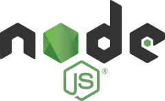

I've recently taken a hefty plunge into front-end development and from what I've gathered from colleagues and friends - there is much confusion as to what is what doing front-end. Especially if you (kind of like I had) not been near enough to the javascript community and thought of javascript primarily as a language hosted in a browser.

Getting into front end was mildly confusing as there were no shortage of unknown words and frameworks being thrown around.

## Javascript is sooo past the browser
Javascript is one of the few language that did the reverse of what most languages do. Namely it started out as a language intended to be embedded / hosted in an application (the browser).

Other languages do the opposite. They start out as languages with a standalone compiler - with the binary usually named the same as the language itself - and shipping with native library bindings. Not until later (if ever) does the language start appearing as hosted in other applications.

I think that much of the confusion stems from this fact - if you haven't payed close attention to the javascript community its easy to mistake javascript for only being that file included from the web-server that is interpreted and run in the browser.

Or so it was. Until node.js [came out in 2009](https://blog.risingstack.com/history-of-node-js/).

## Node.js is the new compiler binary
[Node.js](https://nodejs.org/en/) is just what the ruby, python, perl, java binary is to each respective language. A standalone compiler bundle shipping with with native bindings to do IO, process management etc with the OS. I e a real language.

If javascript hadn't started out as a hosted language in a browser, and if the node.js binary was actually called javascript (or actually ecmascript, see below) it would have been (for me at least) less confusing.

Here's why: if you for a second ignore that it also runs in the browser and still mostly targets the browser things become more straightforward. See - after the rise of node.js - javascript as a community followed suit to what happens to most languages that gain enough traction: an ecosystem started to emerge.

I'm calling the node.js compiler bundle for desktop-javascript from now on to distinguish it from the javascript running in the more limited browser enviroment.

## Package management: npm / bower
The first thing that any respectable language gets after its standalone compiler is stable is its own package-manager. Think of [gem](https://rubygems.org/) for ruby, [pip](https://en.wikipedia.org/wiki/Pip_\(package_manager\)) for python, [cpan](http://www.cpan.org/) for perl etc.

[npm](https://www.npmjs.com/) is the package-manager for desktop-javascript. It actually comes bundled with the node.js install package. With node.js serving as a standalone compiler you can now add libraries to your node.js application via npm install. The npm command operates mostly on a file called [package.json](https://docs.npmjs.com/files/package.json) in the root folder of your project. Its main usage is to install any [dependencies](https://docs.npmjs.com/files/package.json#dependencies) it has stated under the ''dependencies" section.

There are other package mangers with the biggest runner up being [bower](http://bower.io/) (itself installed via npm). These other package managers usually have a niche that sets them apart from npm. Bower for example has a flat package structure meaning that you can include browser libraries (such as jquery, angular etc) with a relative path in your .html file.

It also does not nest dependencies so you have to manually resolve conflicts between libraries (which makes sense if you're serving it in a browser and cannot afford to download 3 different namespaced versions of say jquery).

## Build system: grunt / gulp
Again following the language ecosystem trajectory: the next thing that usually appears is some build system used for automating things. Think [rake](https://github.com/ruby/rake) for ruby, [scons](http://scons.org/) for python, [gradle](http://gradle.org/) for java (I can't add ant and maven to that list since they are sadly declarative only).

Build systems operate on configuration file to build your project into a library of some kind along with housekeeping tasks while doing that.

[Grunt](http://gruntjs.com/) was the first make system to appear for desktop-javascript. It uses a more configurative style and relying on plugins to do the work using the [gruntfile.js](http://gruntjs.com/getting-started#the-gruntfile) configuration.

The crowd now seems more set on [gulp](http://gulpjs.com/) which comes which favours code over configuration and also streams the result without writing the intermediary format to the disk at each step like grunt does. Gulp reads and operates out of the [gulpfile.js](https://github.com/gulpjs/gulp#sample-gulpfilejs) configuration.

Essentially what most build tools are used for in desktop-javascript is:
*   clean
*   run tests
*   linting
*   build dev version - transpiling files (for example less or sass files to css) concatenating modularized files into one browser-download-friendly file
*   build release version (minified version of the dev file)
*   assemble resources - e g copying images to the public www/ folder
*   generate source maps
*   start up a dev http-server and start serving your web application

## The usual ecosystem suspects
Above the essential package and build systems there are (like other ecosystems) a plethora of frameworks.

Honorable mentions are:
*   [jasmine.js](http://jasmine.github.io/) or [mocha.js](https://mochajs.org/) for unit testing.
*   [karma](https://karma-runner.github.io/) for test running
*   [express.js](http://expressjs.com/) for a server-side web framework
*   [yeoman](http://yeoman.io/)  for scaffolding out new projects
*   [jshint](http://jshint.com/) for linting
*   [babel](https://babeljs.io/) for transpiling ecmascript version 6 into a lower browser compatible version

## Browser is still king
Even though desktop-javascript now can run on the server only - the most common job for desktop-javascript is still to assemble something that will run and execute in your browser.

If you peek behind the curtains (the respective github page) for some large javascript frameworks such as [angular](https://angularjs.org/), [react](https://facebook.github.io/react/), [ember](http://emberjs.com/), [backbone](http://backbonejs.org/), [knockout](http://knockoutjs.com/) you'll find that most of them are themselves built with desktop-javascript tools such as node.js, npm, grunt / gulp into a deliverable library (a minified .js file) intended to run in the browser included as a `<script>` tag in your html-page.

## Ecmascript... waaa?
But we're not done yet. The word ecmascript also gets thrown around. [Ecmascript](https://en.wikipedia.org/wiki/ECMAScript) is the actual [language specification](https://www.quora.com/What-is-ECMAScript-exactly-Is-it-different-than-JavaScript-Should-I-learn-it) of javascript. Again - when dealing with another more traditional language - the compiler is usually also the spec (or the spec is the compiler). And they're called the same. Not so in javasc... err ecmascript.

There's a [funny story](https://youtu.be/v2ifWcnQs6M?t=7m47s) behind why javascript is officially called ecmascript complete with litigations and all if you're interested.

Ecmascript like any language is versioned. The current finalized standard is version 6 (also called ecmascript 2015). However. Since so many parties are involved in this ecmascript bandwagon just about every major browser vendor and its brother-in-law [maintains its own implementation](https://en.wikipedia.org/wiki/List_of_ECMAScript_engines) of some version of the ecmascript spec.

And those vendors do not synchronize their watches of course. So there is [another page](https://kangax.github.io/compat-table/es6/) stating what feature in what version that is supported in what. And that's why things like [babel.js](https://babeljs.io/) exists - to backspile es6 features in to es5 which is widely regarded as supported in all the major browsers.

## Wrap up
So there - once you ignore the fact that its primary usage is still to run in the browser and ignore all the naming confusion as to the language spec and that the compiler bundle should have been named ecmascript the rest of the ecosystem is pretty much the same old same old.

And a kicker regarding all confusion as to naming - when you're short on a deadline you can tell your boss that - "Oh, I'm also doing an ecmascript implementation of this thing in parallel, that's why its taking so long".
