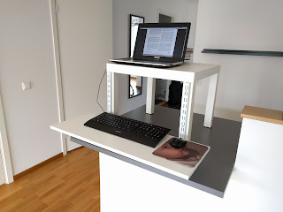

This post might be a bit out of the ordinary, but don't worry. It's all part of a greater scheme (somehow).

*To TL;DRs with love - the action shots are at the bottom of the post*

All of this was sparked by a [youtube video](https://youtu.be/5MgBikgcWnY?t=11m32s) (like all major life events) on learning something in 20 hours. I decided to try that. Step 3 in that video was to remove practice barriers. Not being standing was actually a barrier to practice.

## The why
I have an office upstairs. But there are two problems with that office.

I've noticed since I moved the laptop downstairs from that office that I'm much more prone to start and continue to work on projects (and whatnot) when the computer is physically nearer. The office is (unfortunately) good for paying bills and such - but it's not really a good tinkering and learning place.

Second problem is the actual sitting. I like to pace and wander whilst learning. It makes me digest the material better. I also like to alternate the learning sessions with manual chores as to more internalize the material (and have a home that doesn't fully look like a dump).

Since I'm a white privileged middle aged man purchasing a standing desk in itself is not the real problem - it's that it can't be fitted where I'd like to have it. Also it does not move easily and you have to put furniture around it - in essence building just another office a new location.

I wanted the computer physically nearer and accessible when standing on a location of my choice - was that too much to ask?

## Existing solutions
There [plenty of hacks](https://www.google.se/search?q=diy+standing+desk&oq=diy+standing+desk&aqs=chrome.0.69i59l2j0l4.3704j0j7&sourceid=chrome&ie=UTF-8) out there like this already - but my gripe was that all of them just converted a sitting desk into [a fixed standing desk](http://iamnotaprogrammer.com/Ikea-Standing-desk-for-22-dollars.html#comment-689429716) in the same location. I wanted something that could be moved around so you could be standing when the situation called for it. I also wanted the furniture to not take up any extra place whilst not being used since a desk takes up plenty of space.

I started to search for how to adjust leg-height on tables but came up empty. So I did some thinking and realized that the height of the desk was not the main problem. It's the height of the keyboard and mouse that needs adjusting. The screen height is often ok as long as you have a screen that can be tilted or adjusted (which covers every laptop and most modern monitors). So if you're using an external keyboard you can treat the laptop as any screen.

So this is a remix of the 22$ Ikea standing desk hack using an [ELFA system](https://www.elfa.com/) for the adjustable keyboard and mouse-stand. Or actually it's a cheaper knock-off of ELFA's system which makes the price-tag even more pleasing.

## Setup
You'll be needing:

A coffee table - I'm using [IKEAs lack](http://www.ikea.com/se/sv/catalog/products/20011413/) because that's a suitable height when placed on a desk or counter top.

[ELFA rails](http://se.elfa.com/site/en/gbr/products/classic/traditional-shelving/wallband), [shelf brackets](http://se.elfa.com/site/en/gbr/products/classic/traditional-shelving/traditional-bracket#) and a shelf for the keyboard and mouse. In Sweden there are cheaper knock-offs for the ELFA stuff so look around and see if there is such a thing where you live before splurging. The shelf I chose was 80 x 30 x 16 cm which allowed a keyboard, mouse and some hand rest.

## Tools
Aww yea, hardware talk!

*Tools of the trade*

In the lovely picture above you'll find: Level to get it correctly, ahm.. leveled, a pen for marking up the ELFA rails when cutting, carpenters square for getting a cut with straight angles, file / rasp to remove any sharp edges off the rails when done sawing, hacksaw for cutting down the ELFA rails to apropriate size, drills for pre-drilling holes for the rails and in the shelf and a screwdriver for adjusting screws (it's easy to maul them with the drill).

## Assembling it
First up you need to measure and possibly cut off the ELFA rails to match the legs of the table.

*Original size rails*

I did cut of about 1/3 of the original being 64 cm tall. I then used the files to smooth down the cut to not leave any sharp edges behind.

The onto screwing it to the table-legs. Measure and level and all that stuff so they fit alongside the table legs. Here I ran into problems. I originally opted for regular wood screws but the material in the legs is very porous (made from a particle board like material). So 2 of 4 screws stuck, the rest chewed up the innards of the legs.

*Chewed up by screws*

The solution was to use plaster anchors which are originally made for plaster but worked fine for particle boards too.

Replacing all the previous screws with these made the problem go away. The fit was really snug and trustworthy.

*Plaster anchors to the rescue*

So the rails are mounted - happy happy.

*Rails finally mounted and leveled*

Onwards mounting the keyboard stand. Maybe obvious comment but do mount the shelf brackets and check leveling before proceeding. Just in case y'know?

*Practicing TDD*

Again probably obvious but put the shelf on the brackets and center it just to see what you're dealing with.

Here's another gotcha - when dismounting, the self brackets fold upwards some degrees so make sure you leave space enough between the rails and the shelf for that to happen.

*Estimated space needed to allow dismount*

I used a matchbox for prototyping before deciding how far out the self would sit from the legs. In my case 1.5 cm from the rails mounted to the legs.

*Simulation of needed space during a dismount*

Then - hold your breath and screw in the first bottom screws.

Mount it and make final adjustments on the placement angle before screwing in the two front screws. And not to worry - if the rails are too wide or narrowly placed for the shelf brackets you can adjust either the brackets or the angle of the legs. So you will be fine even if they're slightly off.

That's it.

## Mounting time!
Here are some action shots.

*High counter top = low keyboard stand*

And another with the stand mounter higher on a lower table.

*Lower table = higher keyboard stand*

And here it is dismounted and acting like a normal furniture akin to a super hero at the office.

*Keyboard stand dismounted serving some tea and brownies*

If you're really pedantic you can twist the legs pi radians hide the rails under the table. No one of your shallow friends will even suspect that innocent table doubles as a research station of many interesting things.

## Final thoughts
It's more forward heavy than I'd anticipated and in the beginning this annoyed me somewhat. A heavy press with the palms of my hand and the table tilts towards me (but still has a long way to go before falling).

After using it now for a couple of hours it doesn't really matter anymore. I don't press that hard and can rest my palms on the shelf. If you're a hard presser when typing you might want to go for a table with some more weight to it or place / mount counter weights.

Other than that I'm really happy. I really like the fact that it disassembles into a regular furniture within seconds and that there's so many juvenile jokes in this post that I got away with.
