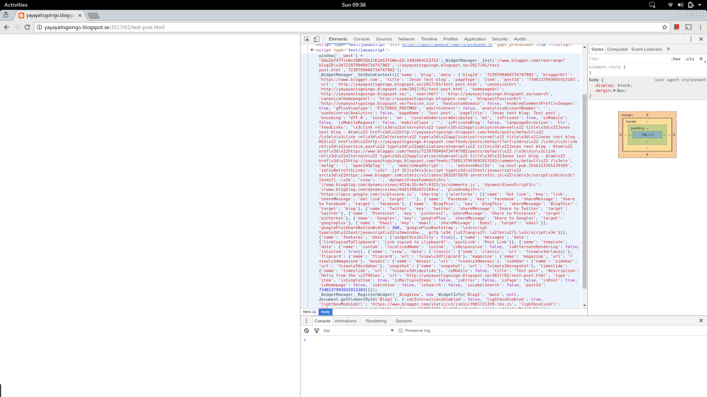
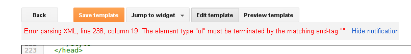

**EDIT**: this page is now off blogger and done with [11ty](https://www.11ty.dev/). Post kept for posterity.

Yeah, so I more than 2½ years ago I moved this blog from [octopress to blogger](http://www.iamjonas.me/2014/07/from-octopress-to-blogger.html). And I also wrote a quite detailed post on how I figured out how the template works in order to bend it into this site. So when I started to think about making more radical changes again I went searching for that post. And found I never published it. Fantastic.

Fast forward to now - I do some research and find out that it's still quite valid. There's still not much information as to how to completely gut a template starting with bare html and eschewing all built-in widgets and controls easing in the ones you need later.

This post focuses thusly on how to create the template ground up. It is on not the structure or how an existing blogger template is composed. It is not for the faint of heart.

## Background
In true 'how hard can it be' fashion I set out to migrate the old octopress blog to blogger. There were an abundance of tutorials on how to create a custom template for blogger - so I thought it'd be a piece of lchf pie to migrate.

Not so (JAWDROPPING SURPRISE!). Turns out most tutorials stopped when it came down to actually doing the work of creating the template focusing more on how the existing template worked and to slightly tune it. Which left me none the wiser. The default template is 2k sloc of tangled string magic. Where to start?

What I wanted was a stand-alone html template with just the blogger text inserted into it. That way I could completely control the html - which was is my one non-negotiable point in moving anywhere with the blog and get the goodies missing outlined in the octopress post.

But there I was staring at the 2k sloc behemoth with hair. And I'm assuming so are you.

Caveats
-------

As said on the outset - this post is aimed at creating a sane template that is highly customizable. However in going that route - the [default theme configurator](https://support.google.com/blogger/answer/176245?hl=en&ref_topic=3339243) and most of the settings inlined in the templatewill break. It relies on widgets and sections being named a certain way and my approach was to go bare metal html. You'll have complete control and can add things back in later. But it's going to hurt.

If you don't want (or know how to) to do html via xml and css this path is not the way to go. [Download](http://bit.ly/zSxS1c) some pre-baked instead. No shame.

Jumping off point - teeny tiny template
---------------------------------------

Since the goal is to build a html page that stands on it's own - and add in the blogger stuff - a good starting point is: what's the minimal stuff anyways? What cannot be removed further? [Here's what](https://gist.github.com/jonaslu/94d8d29debbb8d15db83beb9c4f563cc):

``` xml
<?xml version="1.0" encoding="UTF-8" ?>
<!DOCTYPE html>
<html b:version='2' class='v2' expr:dir='data:blog.languageDirection' xmlns='http://www.w3.org/1999/xhtml' xmlns:b='http://www.google.com/2005/gml/b' xmlns:data='http://www.google.com/2005/gml/data' xmlns:expr='http://www.google.com/2005/gml/expr'>
  <head>
 &lt;!-- /\*<b:skin><!\[CDATA\[\*/\]\]></b:skin>
  </head>

  <body>
    <h1>TEEEST</h1>
    <b:section class='main' id='main' name='Main' showaddelement='no'/>
  </body>
</html>
```

It compiles (== no errors in the editor) and it displays a page with a heading. Ok. But not so useful as a blogging platform (unless your one post is a screaming TEEEST. Then you can use this right of the bat and be done with it).

We'll add in the useful bits of blogger stuff as we go along to make it display data. And don't worry about the CDATA line.

## Widgets
The thing that took most brainpower to figure out was how the data was populated on the page. [Widgets](https://support.google.com/blogger/answer/46995)are how. The name is a bit misleading. I mistook widgets as something quite static that you add to the page - like the stuff you find under Blogger > Layout (small lists, static html etc).

But all widgets are not created equally. The secret sauce is that they have different contents depending on what context the page is shown. I imagine widgets are something like resultsets from queries to the underlying database.

Using this [lovely tool](http://blogger2ools.mystady.com/) that someone wrote you can figure out what data you can pull out of the different widgets on the different type of pages (front page, post page, static page etc). I've just recently also noted that if you inspect your page via say F12 in chrome - there is a script-tag at the far end of the page that seems to populate some object via javascript:



If you copy paste the inner contents of that tag into a js-beautifier, you'll get a dump of some more data that is globally available on the page (I'm guessing this is for the live edit feature, as the page is rendered when delivered).

I'll be focusing on the blog widget. The rest of them can be dug out using the methods in this post - but the focus of this post is to get only a page listing, post display and static pages.

## Blog widget
The most useful (and confusing) widget by far is the[page post](https://support.google.com/blogger/answer/47270#posts)widget as it triples as a page listing and search result for older posts for the main page, an individual post display and the static page display.

The difference is best explained via examples. Contrast these three links:
*   [Front page](http://blogger2ools.mystady.com/#Blog1)
*   [Individual blog: post](http://blogger2ools.mystady.com/2011/04/amazon-s3-hosted-png.html#blog-posts-widget-posts-list)
*   [Static page](http://blogger2ools.mystady.com/p/test-page-one.html#Blog1)

Notice how the post lists data object only contains one item on link 2 and 3 above, whilst it contains several on link 1. A simple [diff](https://www.diffchecker.com/w7lsz2rr)(individual post left pane, index page right pane) will show that the posts-list (on line 49) contains only one item on an individual or static page, but many on the front page.

This means that you'll loop posts on both types of pages. But the post page (as contrasted with the post-list = index page) will include only one item on the post-list array (the current post).

## Sections
Having started with widgets since they are the most important element, all widgets needs to be wrapped in [sections](https://support.google.com/blogger/answer/46888). Sections really don't do anything unless hosting a widget (I'm guessing they are there so that the graphical layout tool can move them around).

Like the link says you can only put widgets inside a section - so your page will probably look something like:

``` xml
<body>
  ...header html...
  <b:section id='header' class='header' maxwidgets="1" showaddelement="no">
    <b:widget \[...attributes...\]>
    </b:widget>
  </b:section>
  ...footer html...
</body>
```

You can get a way with one big section on your page.

## Includables and include
The bread and butter of templates. Reusable sub-sections that gets imported into the main template mustache style. Again like the page says - each widget must have an includable called "main".

``` xml
<b:widget id='Blog1' locked='true' title='Blog Posts' type='Blog'>
  <b:includable id='main' var='post'>
    \[...html and data tags using the widget data goes here...\]
  </b:includable>
</b:widget>
```

An includable can have either straight html using data tags or they can in turn include includes. Includes are like sub-templates, that will be included in the main includable if its included like this:


``` xml
<b:includable id='main'>
  <b:loop var='i' values='posts'>
    <b:include name='post' data='i'/>
  </b:loop>
</b:includable>

<b:includable id='post' var='p'>
  Title: <data:p.title/>
</b:includable>
```

Evidently, data for the includable is passed via data='{var}' and imported via the same statement in the sub-includable. Since the data for static and post pages will be the same it makes sense to make an includable that can be... wait for it... included in both page types.

In addition to the main includable, blogger adds a ton of other mandatory includables when saving in the template editor. This is annoying but cannot be turned off. What I finally did was setting them with empty content so they are there but take up minimal space.

## Page types
Moving on - how do you know if you're in post list mode or in displaying an individual post - i e how do you conditionally select what includable to display?

There are page types. Its just not that well documented. Again some fine person has coded up on the [type of pages](http://mystady.com/2011/05/7-blogger-page-types-analysis-code.html) and how to detect when what is what.
Using the page detection type we can now select includable depending on what the page type is - since the post listing and the post display should look different:

``` xml
<b:includable id='main' var='post'>
  <b:if cond='data:blog.pageType == &quot;item&quot;'>
    <b:include data='post' name='post'/>
  </b:if>
  <b:if cond='data:blog.pageType == &quot;static\_page&quot;'>
    <b:include data='post' name='post'/>
  </b:if>
  <b:if cond='data:blog.pageType == &quot;index&quot;'>
    <b:include data='post' name='postlist'/>
  </b:if>
</b:includable>
```

## Post listing: newer and older posts
Due to limitations in blogger you cannot display all posts in a single post listing (on the index page). It can be tweaked in the settings but it only goes to 500. Any by 500, google displays 8. So to get the post listing in place we need to display and older and newer post link (given that there is newer or older posts).

How to do this then? If you check the diff a couple of sections ago - there are two fields called newerPageTitle and olderPageTitle. The data tag is empty if there are no newer or older page listings. So to get the complete post listing you can switch on if the string is empty or not and display a back / forward link.

``` xml
<b:if cond='data:olderPageTitle'>
  <a expr:href='data:olderPageUrl'>Older entries</a>
</b:if>
```

## Globally available data
Phew. With that out of the way - something a bit more simple. Remember (almost) all widgets needs to be included in a section? Not the [globally available data](https://support.google.com/blogger/answer/47270#global). This is typically settings and stuff you find under the Blogger > Settings in your blogger account dashboard.

Thusly they can be used anywhere in the template freely e g would be meta data in the header or as a switch for conditional rendering if a certain page is active (useful for using static pages as navigation).

## The rest
Now that we've got that down. The rest starts to look like a [horrible templating language](https://support.google.com/blogger/answer/46995). You've got your loops - which you'll be using on the post list page. You've got your conditionals which we've already used to switch on the page type. And you've got your data tags that populate the data in your html.

## Troubleshooting
The process was not without quirks naturally. I do recommend using their built in editor at least at checkpoints during the making of your template. It adds stuff you might not know is mandatory (all the includables after the main includable in the Blog widget for example) and validates not just syntax but also slightly on semantics (only widgets in a section etc).

With that said the editor got a bit quirky at times and I had to quit it and go back for it to stop showing an already fixed error message. Think of it as shutting down your IDE because some indexing of files got out of whack.



Hence - don't trust error messages too much. Run the xml trough a validator if you can't get the editor to accept it. If the xml is correct, back it up, quit the editor and go back.

It might also print out error messages in the preview and not the editor itself (such as not having a widget) - so if everything looks fine and dandy, try to preview it once in a while.

Also - the old adage - "when in doubt - use cout" applies here too. You can - just like the blogger2ool page listed above print to your page in clear text what data a tag contains. Wrap the tag in a <p> or some element that displays the raw text.

## The CDATA hack
Ha, almost think I'd wouldn't get to that one did you? It's a hack. The template needs a [<b:skin></b:skin>](https://support.google.com/blogger/answer/46871?hl=en&ref_topic=6321969) tag on the page or the editor will complain. The problem is that this tag includes bundled css from google that will collide with your custom css.

So this hack wraps the included contents in in a comment and the css is not downloaded and parsed.

## The quoting text hack
Here's the last weird part. Since the blogger template is an xml file and the template-language (so to say) also is xml - which uses, you know, angle brackets as delimiters. It get's weird when you try to mix html with the blogger statements. Angle brackets open and they close. But they do not nest.

Let me illustrate that for you:

``` xml
&lt;li class=&quot;<b:if cond='data:blog.url == data:blog.homepageUrl'>active</b:if>&quot;&gt;
  <a expr:href='data:blog.homepageUrl'>
  How to
  </a>
&lt;/li&gt;
```

That little piece of horrendous stuff means that you need to html escape the... html so blogger can get it's conditional statements mixed in with regular markup. But it's only when xml and html collides. Html by itself is fine, and xml by itself is fine.

## Lessons learned
Start by making a working mockup of your blog in straight html. Then superimpose the blogger xml stuff on it. Its way easier to get a working mock first before feeding it data. That way you will know if the layout errors you're getting comes from blogger itself and not your template.

Should be needless to say but when working with the editor - back up your template somewhere (using git ffs) and continually import it. You will be happy you did when you have to revert to a working state having destroyed something.

Store the CSS in a file of its own or as a `<style>` tag in your template. You'll be cutting and pasting that section into the blogger template later.

If you are aiming for a responsive template - ignore all the 'mobile view' stuff in blogger. Make the site responsive using standard html (this blog uses bootstrap with their responsive grid). Its just html so content can be served into responsive html instead of using the mobile view hack.

## Wrapping it up
Since you have read all the way here. I've since writing this post [open sourced my template](http://www.catchmecode.com/2014/10/open-sourcing-my-blogger-template.html), made a [demo site](http://responsiraptor.blogspot.se/) and then did nothing ever since. Fantastic.
