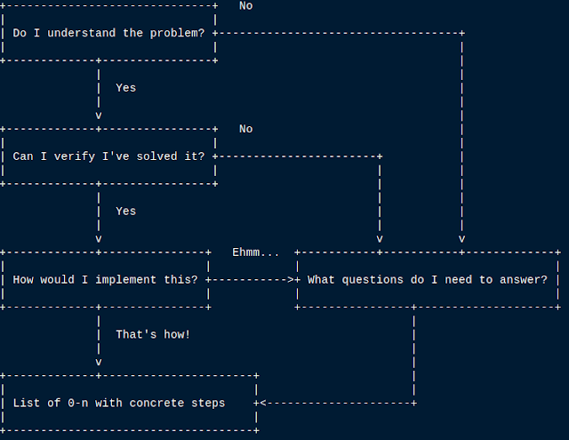

Does this sound familiar? You're about 95% done, just some touching up then commit and run. "This afternoon or tomorrow morning at most" you tell the stakeholders. And out of nowhere it jumps up and bites you. That little detail you left for last is now what throws the entire effort overboard.

I've been there. And so have you.

## Background
I'd lie if I told you that [speed doesn't matter](https://www.iamjonas.me/2013/12/get-it-right.html). [It does](https://www.iamjonas.me/2013/07/fast-programmers.html). I've tried to be fast with disastrous results. After starting to introspect a short period each day I even had a catchy name for it: the hero syndrome.

"OMG! We're sooo behind on this sprint, none of the tasks are done and we're due tomorrow!"
"Not to worry, I've finished them all, refactored the entire code-base this morning and then had breakfast".

Bewildered thankful stare ensues... a dramatic pause and a thundering applause breaks out.

It's a fantastic feeling. I think.

Being fast has two sides. The first is the highly visible mechanics of when you have the right solution. I e choosing smart algorithms, using shortcuts and vim optimally and churning out perfectly minted code. This is indeed a fascinating thing to study and try to perfect. But there's a small caveat. That you have _the right solution to begin with_.

The hero syndrome (or lack of) had a massive driving assumption: Grasping at any solution that looked superficially right and then diving right into trying to maximize the mechanics of having _the right solution_. I e being fast by being lucky. And I'm not lucky.

## Trading stocks like a pro
In stock trading there a thing called [selling short](https://www.investopedia.com/terms/s/shortselling.asp). It's also known as blanking. You believe that a stock will fall and thus you borrow a stock from some other shareholder at some interest whilst the stock is held. You sell it at some price and then wait for the price to fall so you can buy it back at a cheaper price returning it to the owner and pocket the difference between selling and buy-back price.

This is dangerous strategy as the possible gain is limited to your selling price. You can't buy it back for less than 0. But the downside is unlimited. If the stock price instead rises, and theoretically the price can be infinite, you're forced to buy back the stock at whatever the current price is and pocketing a net loss for the buy-back minus selling price. There's a potentially huge cost for being wrong.

Jumping to and trying to optimize the work put into any solution is akin to selling short. You're betting on knowing what the future holds and pocket the time that would be spent thinking about the correct path and assessment of the problem possibly trying to squeeze out a few extra time-units by typing faster and choosing better data-structures.

But the downside is also unlimited as you can spend unlimited time guessing, implementing and optimizing faulty solutions. Smart data structures are a good thing but only if they solve the correct problem to begin with.

## Hammock driven development
When realizing this was a problem I started to look around at how to mitigate this. Fairly quickly I stumbled onto Rich Hickey's seminal talk [Hammock driven development](https://www.youtube.com/watch?v=f84n5oFoZBc) (transcript [here](https://github.com/matthiasn/talk-transcripts/blob/master/Hickey_Rich/HammockDrivenDev.md)). In this talk Rich outlines his method of solving hard problems. Go watch it, it's time well spent.

The gist of it is: were not spending enough time upfront explicitly stating and understanding what the problem we're solving really is. Once well understood we can then propose a solution and assessing whether that solution actually solves the proposed problem. It involves writing things down. A lot.

## Peak again
When reading the book [Peak](https://www.amazon.com/Peak-Secrets-New-Science-Expertise/dp/1531864880) by Anders K Ericsson et al, I was struck by research contrasting experts to novices in the way they approach solving a problem. Experts in a field spend more time at the outset thinking about the nature of the problem and possible approaches before jumping in solving it. This echoes well with Rich Hickeys sentiment. Spend more time upfront.

What Peak added was that experts not only spend more time upfront but also regularly revise their plan as the procedure progresses. An example is a surgeon performing surgery and then something unexpected is found or happens during the procedure. Not adjusting the initial plan to the new facts would be literally fatal.

Just because you had a good plan and done your homework in the beginning doesn't mean you can relax. There'll be unknown unknowns. The difference is how resilient your original plan was and how you now can accommodate with obstacles.

## Mental models
According to Peak - what separates experts from novices is a little thing called mental models. It's an internal representation of a domain. These are fancy words for how well you know, understand and can manipulate something in your head.

I'd hesitating to call mental models pictures or images though they often correspond to it - it's any form of representation of something you have in your head - be it pictures, sounds, smells, rhymes, analogies, movie clips.

This is how expert doctors diagnose patients - by quickly sifting through thousands of symptoms for diseases and being able to narrow in on one (or a few) that share all the traits you've just described and possibly shown.

It ties in with deliberate practice that I've touched upon from Peak [before](https://www.iamjonas.me/2019/08/getting-better-at-it.html). The goal of deliberate practice aims at building better and deeper mental models. As does the [Dreyfus model](https://en.wikipedia.org/wiki/Dreyfus_model_of_skill_acquisition). It categorizes people into how detailed, connected and numerous their mental models of whatever (be it chess, nursing, programming) are.

## Defining the overview mode
Taking from the sources of Richs talk and Peak I experimented with something I've given the slightly less catchy name of overview mode - to contrast it from code mode.

It goes like this: Grab some pen and paper and walk to a physically different location away from your computer. I've noticed that simply being near a computer will be a siren-song for jumping in and starting to implement. If this is unpossible then at least lock the screen and or close the lid.

Then write down the problem you're solving. Really word it out with all the facts and requirements you've gathered and or been handed. Do not skim over this part. A common pitfall is to not look up or have full knowledge of acronyms, patterns or terms and definitions.

If a concept is less than well known to you - make a list of 0 - n with concrete steps on how you make sure you've understood that concept before moving on. In here are details that will bite you when you're 95% done. Then go answer them (but read on first).

## But why?
Once terms and problem definitions are in place then write out why this is a problem worth solving to begin with. Perhaps it's a dumb request and not a problem worth solving in the first place and you need to tell people about it?

People will generally give solutions to their problems instead of what the real problem is. Dig deep to find out the root cause of their solution. And don't be afraid to say no. It's malignant (but often fun) to watch when users build their own solution to oblivion by adding feature upon feature to solve some very local problem.

You are the guardian of the maintainability and design of the application. Saying no is a cornerstone in that role.

## Assessing the solution
If it indeed turns out to be a problem worth solving: write down how you can assess the correctness of your solution. In rare cases this is straight forward. Most of the times this is not so and there will be a bunch of questions piling up.

If so, write out the questions numbered from 0 - n with concrete steps you can take to answer these questions. Then go answer them (but read on first). The assessment will most likely be some type of [test plan](https://www.iamjonas.me/2021/04/the-test-plan.html).

With test plan I do not mean actual unit or integration test cases although they can be codified as test cases if it's one of those rare times it's worth doing. It's simply a boring list of manual steps to prove the change does what you expect it to do.

If some one else but you are dependent on these artifacts or code - run the verification steps by them first.

## No questions?
If there are no questions to answer take a deep breath and be just a bit uneasy about you actually understanding this. Then start backtracking from the steps in the test plan to how you need to transform the code base to where it produces the desired outputs and or your test plan passes.

The outcome will be a list numbered from 0 - n with concrete steps you can take to implement the solution. Here might again be questions or weak areas of knowledge. You now know what problem you're solving but you might not know the surroundings of where that solution will be put in place.

This is ok. Jot down any areas of research in your codebase or connecting systems or other weak areas you need to know down as a list with the 0 - n questions.

## Outcome of the overview mode
As you can see - the result of the overview mode should be a list of steps you need to do to proceed. Now you're done. Almost. There's just one more thing: Sort the list from hardest to easiest. Then ALWAYS do the hardest step of the list first.

The hardest part first is to minimize the cost of being wrong. At any stage your work can be overthrown and it's almost invariably at the hardest part that you'll get overthrown as here are the things that can change the most. By constantly going after the hardest part first you'll discover the road-blocks early and can adjust for them.

Phew.

Here's a flow-chart to make up for making you read all that text:

## Peak meets Rich
Going into overview mode is not done once but manyfold. Along the way things will turn up that you did not expect. That's ok. By going after the hardest step first we're minimizing the risk of it turning up late in the work. And when things turn up you again run it through the overview mode to see if the new turn-ups nullified anything.

Now for the juicy part: spending time upfront on a problem and it's proposed solutions drills mental models of the problem into your head that you can more and more easily manipulate. This is why after a while the problem tends to melt away or an aha insight just pops up.

The neural traces in your brain have been strengthened enough for you to see not only how the problem relates but how it is correctly solved. As a nice bonus you'll know the system you're working on too better simply because you've spent more time thinking about how it works and how it should work.
