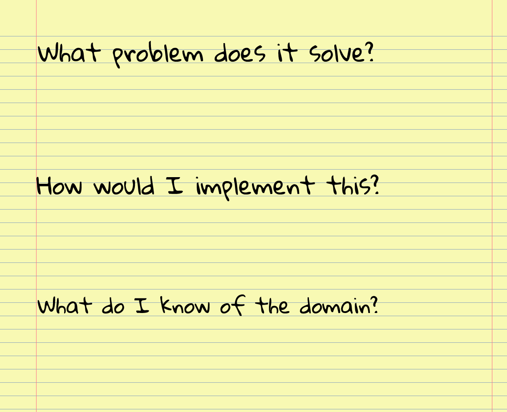
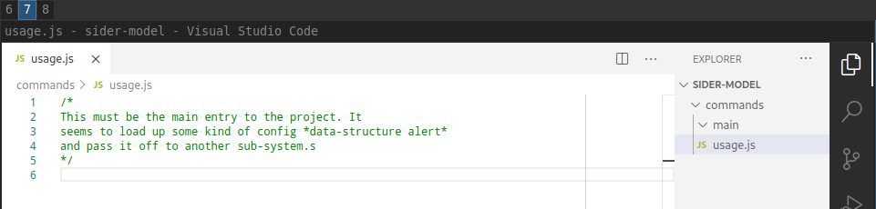
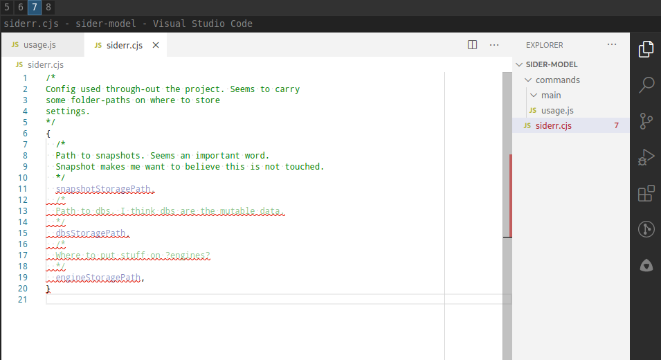
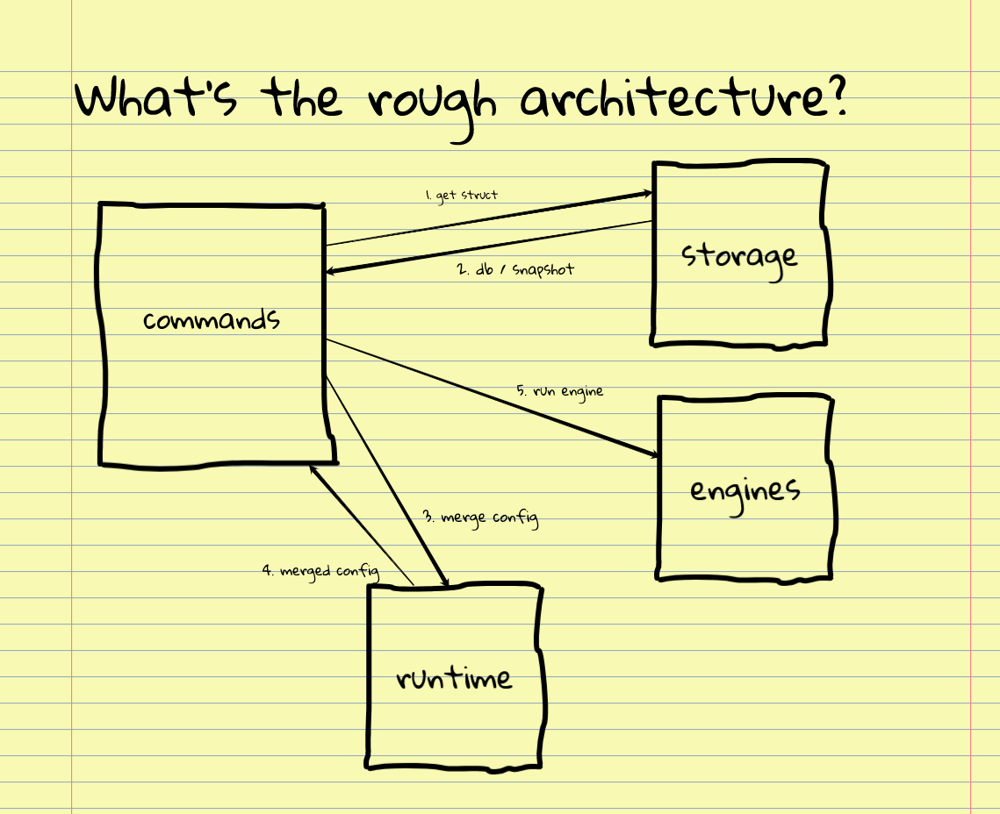
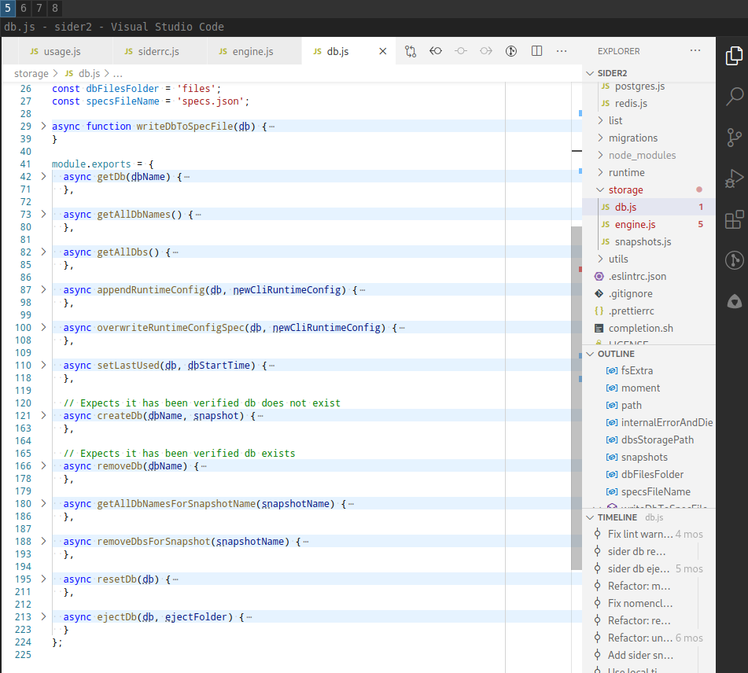
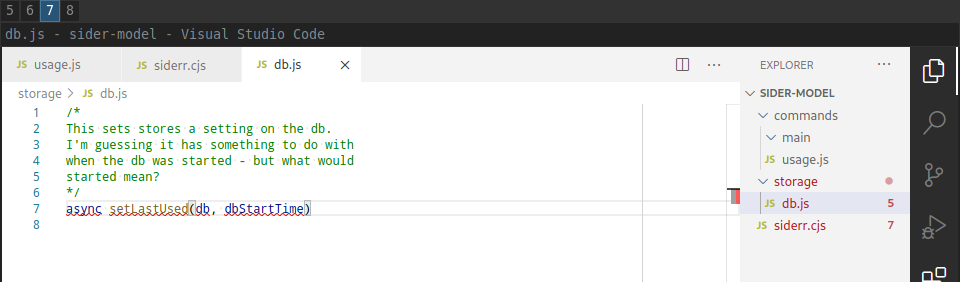
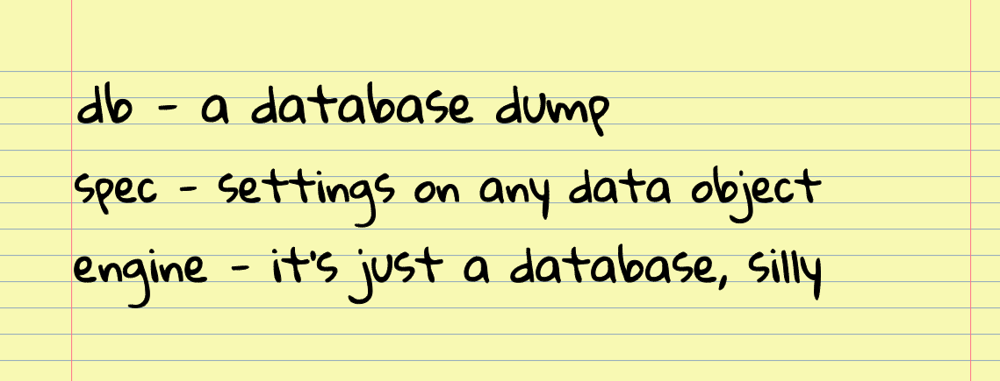
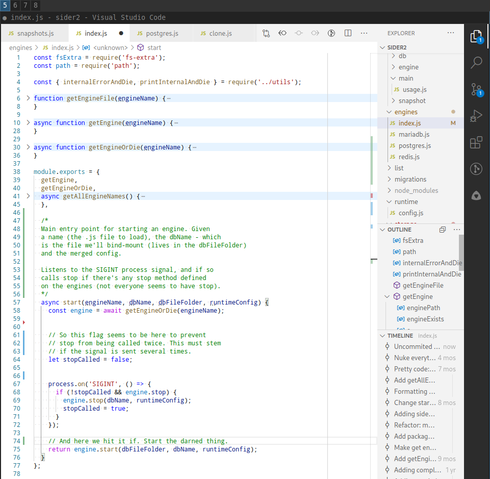

How do you change code in a large code-base with confidence? That depends of course. If you are the author of the code, changing something you wrote yourself with confidence should be easy. Every nook and cranny will be well known to you.

You run through the subsystems in the code and check for impact, make the change and test it to verify you haven't missed anything. But greenfield projects where you will be the sole author are exceedingly rare in my experience.

More common is to be thrown into an ongoing project. Or even more common is to be added to a project because key personnel left. With no time for handover. So how do you get up to speed and make changes with confidence then?

I started out like I guess most people start out - read one file, move to the next and hope it makes sense after a while. And it does. But it can be a very long time with embarrassing disasters before that confidence comes.

Disasters usually set back the confidence a notch or two. Realizing this I started to research and experiment on how you can achieve confidence in your changes in less time.

## Mental models
I've mentioned mental models [before](https://www.iamjonas.me/2020/06/overview-mode.html) as it's prevalent in anyone who has mastered a subject well enough.

Let's nail the definition down first: A mental model is a simplification or an abstraction of a system that you carry around in your head. It's a few principles / images / sounds / phrases that acts as a stand-in for the actual system.

They're not the real thing, but they're close enough to be correct 95% of the time. When someone asks you "can we add feature X?" you first say "no" and then you go to your mental model of the system and investigate the impact to check that you are correct.

In software the materialization of these mental models is often a drawing with boxes and arrows or pseudo-code and call-charts depending on the level you're describing.

## Why the fuss on mental models?
Trying to understand a new code-base is trying to get a mental model of the program into your head. When I have a decent mental model of it I can judge the impact of changes made and be sure the change does **only** what I intend it to.

So this will be our end goal. Building a fairly deep understanding of the architecture of a program. All good but nothing groundbreaking so far. This is what everyone must do in order to safely do changes - even reading one file and moving on to the next until it makes sense builds a mental model.

But it's slow. So let's see how we can supercharge this.

## Active recalling
I've made a vow - which I mostly stick by - of never copy pasting code. It's a trick I learned from Zed Shaw in his course "[Learn C the hard way](https://learncodethehardway.org/c/)". I'll type it in myself without looking at the original.

Then I go back and forth and [diff](https://en.wikipedia.org/wiki/Diff) it with the original code until they match. Why? It builds better understanding and retention. By typing out the code I've just read from memory I'm forcing my brain to pay better attention.

And in this lies the wonderful bootstrapping process of understanding. Actively trying to recall something will at the same time increase your understanding of it. The process of trying to remember things from raw recall has been dubbed just that: [active recall](https://en.wikipedia.org/wiki/Active_recall).

There's been plenty of research on learning for decades on active recall and the trick from Zed Shaw is one take on it, you force your mind to recall without looking.

## The generation effect
There's another trick to more accurately recalling the correct answer called the [generation effect](https://en.wikipedia.org/wiki/Generation_effect). I stumbled upon this in the book "[Make It Stick](https://www.amazon.com/Make-Stick-Science-Successful-Learning/dp/0674729013)" by Peter Brown.

The gist of it is if you're forced to come up with an answer to a question even when you are dead wrong pays off. Studies have shown that by making students guess the answer to a question even when the subject is totally unknown boosts the retention of the correct answer once it's revealed.

This sounds right up our alley since the code-base is largely unknown. We can leverage this effect and make the learning more efficient by guessing what parts do before actually reading them.

## How to read a book
The last source to super-charge our learning is from a book called "[How to read a book](https://en.wikipedia.org/wiki/How_to_Read_a_Book)" by Mortimer J. Adler. The book details how to read a book. Well duh, I thought. But it's well worth a read.

I was very surprised at the methodical approach and how unstructured I was prior to this. Learning a book and learning a code-base have (un)surprisingly much in common.

This book will be the driving force of the processes of learning the code base with the super-charged methods above sprinkled in. The book outlines four levels of reading.

I'll include a shorter version of the three first levels as they are of interest to this post.

## Three first stages of reading a book
**First level - Elementary reading** - in which the reader is not hindered by the language (i e is fluent in reading the language of the book). At this level the reader reads a book cover to cover not giving it much thought of the structure or if it's a book worth reading before the end is reached.

This is the most common level to read at. Not surprisingly according to the authors there's more efficient ways (and more work) of really understanding a book.

**Second level - Inspectional reading** - in which the user tries to find out the most of a book in a limited time by asking the question "What is the book about, as a whole?".

The first phase includes skimming, reading the back and front-matter, the TOC, the index and a few selected pages here and there.

The second phase is reading the whole thing on a timer not stopping to understand details. This is because you most certainly will get lost on details. There is no big picture to make sense of the details yet.

This matters even more when reading code.

**Third level - Active reading** - in which the reader understands the book by bottoming-up from finding the most important words the author uses all the way up to the arguments the author has used and how well the author answers the questions the book set out to answer.

As you can see the process involves first top-downing the book and then bottoming it up until you grasp the whole. The top-down process involves scanning for the important bits and the bottoming up connecting what you've deemed as important to the rest of the book.

This makes sense. We learn best by first going after the general major concepts. Only then does the details make sense as you can associate them with the major parts.

## Being an active reader
It's not enough to merely read it in this way. An active reader asks and tries to find answers to questions. By doing this we increase difficulty making the understanding and learning even deeper.

An active reader hopefully writes down the findings and answers to questions posed as writing things down makes them stick better in your head. I'll assume that there is no up-to-date documentation on the project you are about to learn.

I'm hard pressed to recall one instance where the documentation was good enough to actually help understand the code-base. The perils of documentation is akin to that of a commentary in the world of books which the authors warn against.

A commentary is a book that comments or summarizes another book. You're getting someone else's view on the project. It will probably be outdated. If there is documentation be very sceptical of its correctness and don't rely on it until it's proven correct.

This equates to RTFS.

## Assuming elementary level
Reading below the elementary level is not being fluent in the language of the book. Same goes for the project you want to learn.

If you don't know the syntax of your language then stop right here, learn the syntax and then come back. I've wasted many hours trying to understand both language and projects at the same time.

It fails for the same reason that inspectional reading succeeds - you'll get caught in details and you won't even know if just a feature of the language or a significant property of the code you're reading.

## What problem does it solve?
Following the outline of the second and third level of reading let's apply that to learning a code-base. Bottoming-up a code-base is the default. To be able to top-down something you need to know what's on the top and what's on the bottom.

To find that out we'll start with the inspectional reading phase. In the book the question we're trying to answer is when doing inspectional reading is "What is the book about, as a whole?". When learning the code base we're going to slightly alter that question into: "What problem does it solve?"

So - first grab a piece of paper and pen. Write that out as a heading. This is a good way of priming your already existing information. And to add to the excitement of priming your mind add in two questions: "How would I implement this?" and "What do I know of the domain"?

Then without looking at the README or similar - just write down what you know about the project beforehand.

 

All of these questions leverage the generation effect and primes your mind better for what's coming.

Chances are you know quite a bit already.

## Inspectional code reading
Now we'll start looking at code and sift through it in order to start building a mental model.

We'll assume that the project you are about to read is of a decent size (say 20+ files in several folders). As noted in the inspectional reading of a book - skimming code like you skim a book is a bad idea.

Code is even more details than a book and it's too easy to get lost in details. What we want is a very gradual increase in details over time. Inspectional reading of a book is concerned with finding the structure of the book.

It's also why notes taken during this phase are called structural note-taking. You're looking for the main outline which is often embedded in the TOC of the book. There is an analogy in code: folders and files.

The names of folders and files have been chosen to mean something by the author of the project. As such they hopefully will be some indicator of what's important. They might also contain some of the names of the major terms in the project.

I again stress the importance of not looking into the actual files yet - they're full with details that will have you confused.

## Now you get to type
Create a new folder for notes on the project on your computer. Make sure this folder is in some other folder than the original source project. Do a git init as well.

``` bash
mkdir -p temp/sider_copy/
git init .
```

We're now going to leverage the active recall / copy-by-hand technique and the generation effect. I'll use my own self-promotional project [sider](https://github.com/jonaslu/sider) in the examples.

In your new folder manually create folders with empty files with the same name as the files in the project you're investigating.

Do this by looking at the original folder and file-structure then go to your own folder and type in the name without looking back at what the name was by actively recalling it.

``` bash
mkdir -p commands/main
cd commands/main
code usage.js
```

Then - for each file you create - open it up and write a comment at the top and make some small note on what you **think** this file does.



Periodically diff your folders with the source folders to see that you've got the file names correct.

``` bash
diff temp/sider_copy/ code/sider/
```

## On the importance of data
As I became [obsessively interested](https://www.iamjonas.me/2019/08/getting-better-at-it.html) in progressing as a programmer I started to research who's already good at this and what can I learn from them? One of the few books on the topic was "[Coders at work](http://www.codersatwork.com/)" by Peter Siebel.

Scanning for commonality among the top dogs one theme stood out to me: when trying to learn a new program most of them spent considerable time trying to find or figure out the data-structures early on.

This sentiment is echoed by Fred Brooks in his seminal "[Mythical man month](https://en.wikipedia.org/wiki/The_Mythical_Man-Month)" wherein he has the quote: "Show me your flowchart and conceal your tables, and I shall continue to be mystified. Show me your tables, and I won't usually need your flowchart; it'll be obvious."

Why so? Well, I think of it this way. Data can be useful without code, but code does nothing useful without data. Code operates on something and returns something else or it wouldn't be very useful (apologies to Fibonacci and or functional programming zealots).

It'll be hard to understand the code without knowing first what it operates on.

## Now you get to read
So now we return to the code for an inspectional read. This is done with a goal: to identify the major data-structures. Ignore everything else for now as it won't make sense yet.

So how to go about this? A bit of luck is needed. You might not find all of the structures but a good heuristic is that they tend to either live in larger files or in especially dedicated files - especially if they're exported or used by clients.

These files you will probably have stumbled upon by typing out the name of the file in the last section. Set a timer and then scan the files you've deemed important in the first step for any structures.

When you find then - copy them over by hand to your own version of the project. Again make comments around the data-structures on what you **think** they mean.



## Guess that architecture
Great job so far! We're about to try to build our first mental model by guessing the architecture. This is done by answering the question "What's the rough architecture?".

Grab a piece of pen and try by only knowing the folder-names, file-names and major data-structures to map out the subsystems of the application.

With arrows and boxes and data-structures going between the different subsystems.

 

It doesn't matter if you're way off. Thanks to the generation effect merely guessing at the architecture will make the correct stick even more.

Now go back to the first question "What problem does it solve" and see if it needs tweaking or if you've missed something with your latest findings.

We've concluded our first pass of turning the code-base into a mental model. We now have **some** indication of what it does.

## Analytical code reading
We're now in a position to start bottoming-up the code base as we have some clue of what the top parts are. In analytical reading one of the first things to do is to come to terms with the author.

This means finding the most important words that describe concepts in the text and building an understanding of these terms by using the context in where they appear. How to do that then?

Here it's very tempting to reach some code-indexer such as [ctags](https://en.wikipedia.org/wiki/Ctags) or try to make a word-cloud or the likes out of the code. I've tried and failed every time and yet to find a good consistent reliable and easy enough way across languages.

Even if there is I just don't think passively looking at indexed code makes a difference either. It's too easy and shallow. We need to once again reach for active recall, copying and generation to make sense of things.

## Got to know when to fold 'em
A very useful feature in a modern editor is the ability to fold code by collapsing it to only some level of indentation. What we want is the top-level as it hides the complexity of the methods themselves, giving us only the method names.

For the files you've now deemed important so far, open them up in the original project and fold the entire file down to the method level. Here's [how you do it in vs code](https://code.visualstudio.com/docs/editor/codebasics#_folding).

Most editors have this feature so simply google folding in your editor of choice. This should give you the main method signatures of that file.



Using the same method as you did for the data-structures, copy by hand the method signature to your own project and add a comment on what you think the method does.

Try to see if there are any words or concepts that keep coming back in the method-signatures - parameters included.



## Coming to terms
We've now looked and learned the folder-names, the file-names, method signatures and data-structures. Now you will probably have a good feel for what terms are important.

I use terms here as words that describe some object or concept. Grab a piece of paper and write those terms you think are most important down. Also write the explanation for them.

If you're unsure of the explanation - use grep and see if you can pin down what they are.

 

Once done, go back to the architectural drawing and see if it's still up to par with your latest findings.

## Comments
Armed with all the knowledge so far we're now ready to tackle it head on. Put away your copy-by-hand project and make a new branch in the original project. This is your comment-branch.

Again open up the files where the most important code lives and fold it once opened. Then one-by-one open each of the most important methods and scan through what they do.

At the top and inside the method sprinkle in comments on what it does. I call this writing "In prose". Word out like an essay what the method does.



Fold the method once done and unfold the next one keeping details hidden in all but the current method under inspection.

This way we're reifying from code to human-language. I find it much easier to remember the gist of a method this way, writing it back to human language in my own words.

It's a shame code isn't written like this by default for this way we could have applied the "how to read a book" straight off on code-bases too.

Historical side note: There have been attempts at making code like prose with [literate programming](https://en.wikipedia.org/wiki/Literate_programming) championed by the venerable [Donald Knuth](https://en.wikipedia.org/wiki/Donald_Knuth). It's used in the TeX [code-base](http://tug.org/texlive/devsrc/Build/source/texk/web2c/tex.web) and some programs which Donald wrote could not have been written, [according to himself](https://www.informit.com/articles/article.aspx?p=1193856), if it wasn't for literate programming. Consider this a lighter variant of literate programming.

Once done commit the comment branch and carry it around for reference. Now we return to the question "What's the rough architecture" again. Pull out the drawing you made last time and update any errors. This time it should fall out pretty naturally how it works.

Pat yourself on the back. You've now got a good mental model over the code.

## Confidence in confidence
This approach has been built up over many months starting with principles from comments first, copy by hand second and the parts from the book as the newest way of learning.

With such a systematic approach I now have confidence in making accurate changes at a decent pace. This has in turn given me confidence in my confidence (also known as hubris) to the point where I can say I'll figure it out on my own when thrown a challenge.

I particularly love to do that on code or projects where no-one really knows how it works and no-one dares to touch it. You've probably heard it too:

"Oh, that's Steves code. He quit two years ago. We don't touch it, it just works and no-one knows how. Just let it be." So I light up a cigarette which casts it's dim light on my rugged worn face. I'll say in a glass-gargling voice that'll put Batman to shame: "I'll figure it out".

Except it's not a cigarette - it's the steam coming from a cup of herbal tea. And my face is not worn and rugged as it hasn't seen sun in years. And the voice doesn't sound like gargled glass. It's not a voice at all. It's an instant message since I'm a programmer and voices scare me.

But you get the idea.
