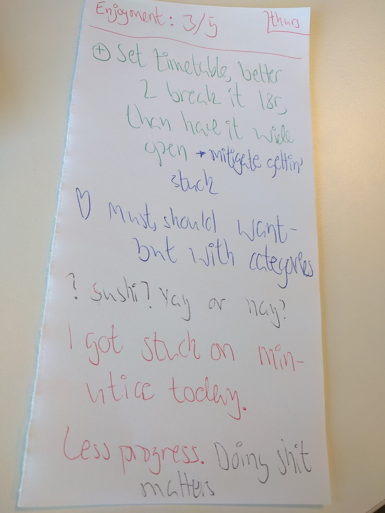

I want to get better at whatever I do. It's a drive I have always had. Later I discovered via Daniel Pink's book aptly called [Drive](https://www.danpink.com/books/drive/) in order to be happy three things are required: autonomy, mastery and purpose.

Programming is a very thankful field when coming to two of the three points made above. There is high autonomy since there are few programmers to go around and since fewer people really understand what you do, you get left alone. You're the expert.

The autonomy tends to increase as you master more and more things as this means more fires put out and faster deliverables. And people hate fires and love deliverables. Even better is that there are very few things but yourself limits the possibility for increased mastery.

If you have a computer and an internet-connection you are set equipment-wise.

## The art of learning
Let's focus on the thing up to you: mastery. My adventures usually start out stealing ideas from a book. One of the first books I read on improving performace was [The art of learning](https://www.goodreads.com/book/show/857333.The_Art_of_Learning) by Joshua Waitzkin.

Joshua was a top-performer in both chess and tai-chi push hands. One involves thinking a lot and the other is mostly physical. In the book Joshua outlines how he quickly rose to the top in both fields via the same process of continual improvement and learning.

Two quotes reading it the first time struck me: "I believe we can quickly rise to the top if we never repeat the same mistake twice" and "Every mistake has a technical component and a psychological".

Joshua had kept diaries of his progress and mistakes since early adulthood and insists that they were an important part in getting better. In order to never repeat the same mistake twice you need to track what those mistakes are.

So I started keeping logs of mistakes and progress. I have up to this date collected material for the last 4½ years more or less each working day on how I was doing and if there is anything to improve.

Here's a random week:


## Have a feedback-loop
In order to know that you are progressing you need some yardstick to measure against. The most common case is someone better and more experienced (having done the trip to mastery themselves) telling or showing you what you need to improve or if you are doing great. But what if there are no coaches or obvious roads to mastery?

Then you need to rely on self-instrumentation. Even on a well known path such as chess or tai-chi it's important to know how to collect feedback yourself since more experienced teachers will become rare and your journey more personal as you progress. And when at the top the only way to stay there in the midst of relentless competition is to self-instrument. So it's a good thing to have in your toolbox no matter what level you are aiming at.

A feedback-loop isn't rocket science. At regular intervals note what works and what does not. Any performer will have 2-3 major weak areas at any given time. The easiest way to increase performance you can do is to fix these weak points. Then do this repeatedly.

If you look closer at any top athlete you will see an obsessive focus on improving their process by lifting the weaker areas.

## Choosing your media
When feedbacking it's important to write things down and keep these in a log - we'll get to more on why later. But in order to bootstrap this process you need to choose a medium to record things in. And in there we have the tooling wormhole so many developers get drawn (or thrust themselves) into. Should I use Evernote, Google Keep some kind of wiki or ...?

I personally love and highly recommend a multicolored pen (such as a 4-colored ballpoint pen) and blank piece of A4 paper.

They look like this:


It's the most customizable and flexible media I know. It allows for free-form reflection and as much as possible stays out of my way in capturing ideas and notes. I fold and tear the A4 into three columns using one for each day of feedback.

Then I snap a picture of the notes taken - usually on a weekly basis because I'm lazy - and store them in Google Keep. This was a random choice and only out of necessity because the notes stack up and are hard to physically manage after some weeks.

Otherwise I'd keep them as stacks of paper.


Don't fall into the tools trap. Choose something. Anything that works for you - but do yourself a favor and keep it lo-fi and choose customizability over flair. Better to get going than to have the perfect platform.

## Ranking
What programming does not have is some formal ranking system. A ranking or scoring system makes it easier to know where you are in the heap of performers. It's also easier to connect the feedback from the scoring system to whatever you are trying to improve. Example: if I use my left hand does the scoring go up or down?


I've settled for scoring myself on a scale from 1 to 5 each day as some measurement of progress. I'm fully aware that me rating myself is a highly questionable metric with a huge bias but I see it as valuable for two reasons: It provides me with some sense of direction over wider ranges of time.

From day to day it's not good but over the course of weeks or months I think the general direction is worth something. Second: the act of setting the grade is a good question generator which is needed when doing feedback - more on that later. What I've done is experimented with what metric to rank such as: focus, flow, enjoyment, productivity, performance, fun and calm but kept the scale the same.

I haven't picked more than one metric per time to work on as it makes the process look more scientific than it actually is. Better to not get caught up in making these digits too much of a holy grail.

One is good enough and doesn't interfere with the rest of the process.

## Mechanics
With that being said: how does a feedback session actually work?

At the end of each working day set aside 5 minutes to pause and make notes on what went good and what could have been done better. Have a timer and commit to doing the full length of the timer even if you finish early or feel like there's nothing to record on that day.

On some days the process will be obvious. Some botched deadline or task that went nowhere. On most days this will not be the case and it's fairly blank. On these occasions I find it helpful to first try to set a grade on the day. When setting the grade I usually ask myself "what could have made this day a grade lower or higher?".

Say I grade the day 2 out of 5 the question would go "what would have made it a 1 or a 3 out of 5 respectively"? Answers to these questions tend to make it into the notes as points of improvement or points of things I should keep doing.

Which is what I'll spend the bulk of the time feedbacking on. Notes on what I sucked at gets prefixed with a + sign for need to improve and things I did good and should keep doing gets prefixed with a heart. The notes tend to be one sentence or a few words summarizing the lesson.

Here's a random note from the archives:



If my mental state is not my ordinary cranky self I'll make a note of it. Say If you've slept bad or had a fight with someone close then this will spill over to what you are doing (which is a good point of improvement - trying to keep the private life disconnected from your professional life).

It helps to have a note of it later when graphing data. When the session is over I put the note in a pile and at weekly intervals snap a picture in Google keep. I add a tag on what week this is with the notes themselves having the individual day on them so I can connect the date to the note later when codifying.

Here's [some samples](https://docs.google.com/document/d/1KSICulh_-b3MMujDVQXG9hlLXB4eQ6H9gUa0XIZRm9s/edit?usp=sharing) of the full 4½ years worth of data (because keep won't let me export all of them at the same time). The headline on the notes follows the regexp:

``` text
/\\d\\d - V\\d\\d/
```

The first pair of digits are the year and the second pair of digits are the week number (as week is called vecka in Swedish).

There are plenty of profanities in there possibly some embarrassing personal details. I also liek to spell words wrong in ways that annoy me.

And remember: it's not voyeurism if it's in the name of science.

## Reflection
What I noticed when doing feedback was that the results or improvements I'd like to implement the next day sometimes got lost. You know how it goes: get into the office, get your cup of hot beverage, someone asks how some feature is going and then you're off to the races only to notice at the end of the day you'd made the same mistake again because you didn't apply yesterday's lesson today.

Applying lessons picked up from feedback is essentially forming and removing less useful habits. As such they need to become automatic in order for you to use them. And to make habits stick you need to work actively at them. Simply noticing and making a note that they are not working wasn't enough for me.

You need to notice and act on it in the moment. And this is hard.

In order to make the feedback process stronger I've added a 15 minute free [journalling](https://en.wikipedia.org/wiki/Journal_therapy) session each morning where I try to recall from memory the feedback note from last day noting what worked and what did not. We now leverage our old friends: the effects of [active recall](https://en.wikipedia.org/wiki/Active_recall) and [generation](https://en.wikipedia.org/wiki/Generation_effect).

This step makes sure you actively try to apply the lessons you learn the previous day and not let the gems of wisdom rot in your chosen form of media.

## Uh, I'm like totally blank
So, what about the days when there's silence and crickets chirping trying to feedback? These days are highly valuable too. There are many levels of feedbacking. One is the daily grind: I've done X - didn't work - I did Y - didn't work then I did Z and that shit worked great.

Both Joshua Waitzkin and Anders K Ericsson in his book [Peak](https://www.goodreads.com/book/show/26312997-peak) talks of a concept known as plateauing. When you start with tracking and correcting your performance you'll likely progress very rapidly at first. Then all of a sudden progress seems to taper off. You've fixed all your flaws! You're done! Right?

That depends of course. If you are certain you have no more unknown flaws then yes. Stop here! You've won! If you didn't win don't be super sad. There are short term improvements and then there's long term improvements. These days are for those long term improvements. We've fixed all the easy to fix problems.

When I don't have something useful to write about that day - I'll spend the time working on questions. Questions are my way of moving onto bigger and unknown flaws. Such as "Where do I waste the most time currently?" or "What's slowing me down" or "Where should I go next?".

Ask big sweeping questions about the general direction you must go in now. Maybe you've milked the options dry in this part and need to turn elsewhere for a while?

Trust that the answer will come to you eventually.


This is the same spot that the top-performers find themselves in. Since they are now at the top - they must have removed all the known obstacles or else you wouldn't be at the top. But relaxing and stagnating isn't an option.

The competition is fierce and not re-inventing yourself and finding more ways to improve means you'll be sent down the ranks because someone else figured out a way. Also - since they're at the top - there will be no coaches or external resources to guide. The growth must come from yourself and it's a wonderfully slow, anxious and creative process.

If the same questions keep coming back day after day then try to make progress by working on those questions. Answers come when they like, but you can work on the question itself. Make it clearer, more general, angle them in some way. Example: "What do I mean by wasting time?" "What can I consider slowing down?" "What would interest or bring me joy to go next?".

It has worked out nicely enough that I don't need to schedule days to work on questions - but I would if I felt there were too few days with questions.

Questions are very important in improving long-term.

## Graphing and research
All we've done up until this point is complain, ask questions or congratulate ourselves on ourselves as performers. Some things might have been easy to correct immediately but the majority of errors will come from your habits or lack of them.

And this is why the second quote from Joshua was also vital: "There is usually a technical and a psychological component to an error". The psychological errors are indeed hard to notice and harder to change unless you have data.

But data we have! Periodically I go over the notes to codify them in a spreadsheet. This is where the ranking system comes in nicely. You can look at the long-term trend, you can look at how volatile it is and you can correlate this to the raw data: the notes.

Here paper and pen have some drawbacks: you need to spend time codifying it. Not only the score - but also the raw data - the notes. I think it's more than worth the extra effort for the flexibility.

It takes some hours per year of data but in my opinion this is not a bad thing and only mildly boring. Manually working with the notes again makes it stick more in my head than if it was already in digital form.

Once codified it now becomes a pure joy asking questions and then slicing and dicing the data to answer them: what happens on the low point days? What trends are there in high-point days? Is it any weekday better or worse? Did I forget some hard earned lessons I should go back and revise again? If I do a word-cloud - what words are most often used? What are my good habits? What are my bad habits?

If you're into this kind of thing chances are good you're into reading books and applying what you read already. You need (and should) read a lot of books. But it might be scattered. With all this data you have some idea of what to improve and where to search for books containing thoughts from folks having similar problems as you.

It's also here the questions you've worked on during days when you were blank serves as springboards to further research.

Here are [my codified notes](https://docs.google.com/spreadsheets/d/1Vn4teIrcMBkyBRGz94PalkoMcWlqqKZ5JOMRQwY6EEs/edit?usp=sharing).

## Experiment
All of this adds up to one great adventure. You get to experiment with different approaches, take notes, change some parameters and go again the next day. The same goes for long-term goals: you do research and apply it. Then you check your long-term progress and adjust. Your progress (or lack of) will be visible and tangible.

I get giddy about these things. It's my own personal laboratory with my favorite test subject - myself! I'm now consistently applying feedback loops on several other topics of interest besides programming and it's paying off really nicely.

## Feedback on the feedback
One thing I noticed after starting to input the latest batch of notes was how dull they were. They read like a report-card: way too standardized and sterile. Notes from a year or two back were much more fun to read. Not good. When notes are dull options the process has stagnated.

Keep an eye not only on what the notes say but also how they say it. Standardized and sterile report-cards kill what the essence of this should be: a fun, curious experiment. I've since vowed to again start to curse more, deliberately misspell words, write more verbatim excerpts from the day and reflect more on successes and failures in flowing prose.

Maybe change the format too - just to avoid stagnation.

## Collecting maxims
Joshuas book was weird the first time I encountered it. I felt I didn't fully get it until 2 or 3 re-reads. He kept throwing around almost zen-like sentences: "Invest in loss", "The downward spiral", "Making smaller circles".

Having done the same for 4½ years I now understand what they were and why they sounded weird at first. These are maxims. A maxim is a behavior or thought pattern boiled down to a simple sentence. I've collected a dozen or so maxims myself.

A maxim is highly personal and extremely compressed. They will probably not make much sense and fail if applied by someone not knowing their full backstory.

The maxim will hopefully pop into your head when you face a similar situation where you'd once had failed. Remember to never repeat your mistakes? Maxims are your guard-rails. It's the catch-phrase of a detailed mental model of your own performance.

These are the gems you are looking for during the entire process.

## So, is it worth it?
Throughout this article I keep saying that it's hard work. This begs the question, is it worth it? And if so, why? Really good questions I must say dear reader!

I'd love to start bragging about blowing colleagues out of the water and rising up the official ranks of hackerrank.com and the likes. Because deep down when no-one is looking, jealousy is a fine motivator.

But here's the thing. That became less and less interesting as time passed. Having a process for improving shifted the focus on the competition to an internal competition with my better and younger looking past self. Having a process in place makes becoming better doable. It's no longer a roll of the dice who's got it and who hasn't.

A lot of the frustration in the beginning is also gone. Not repeating mistakes feels like there is progress. There might be new mistakes but at least they are new and interesting. Less frustration equals more flow. And more flow equals more fun.

Because it feels fun. Really fun. More fun than ever before.

Because it's no longer work - it's play.

## It's a book!
A dozen or so maxims and an intolerable confidence is what you get out of 4½ years of collecting, reviewing, researching and applying feedback. I've already blogged about [some](https://www.iamjonas.me/2020/08/how-to-read-code.html) of the [maxims](https://www.iamjonas.me/2020/06/overview-mode.html) collected in the process. More will be covered in upcoming posts.

I think it's a shame we don't talk more about the thought-processes that go into developing software. Between having an idea and the product is shipped on github there is a huge gap. I have an unhealthy interest in what happens in that gap. What's the thought-processes involved when software gets made?

If that sounds like a work-in-progress book title then you're right. It is. I am secretly fleshing out the chapters of an upcoming book in the form of blog posts. If you want updates on when the next post is out then there are ways in my [about section](https://www.iamjonas.me/p/about.html).

I've read both that you should commit to a project publicly and that you shouldn't in order to finish. So in a very Swedish neutral way let's keep that book between you and me, yes?

Then it's committing but not publicly.
