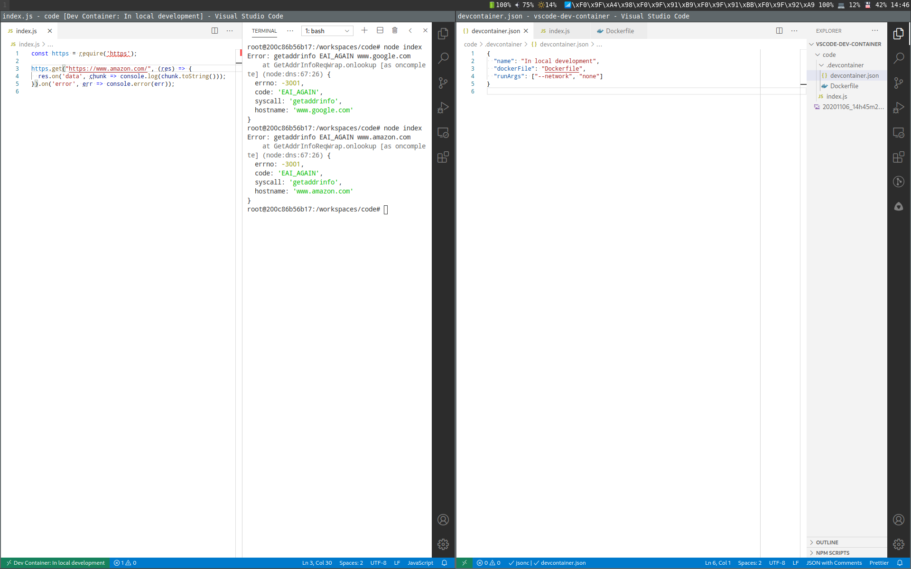
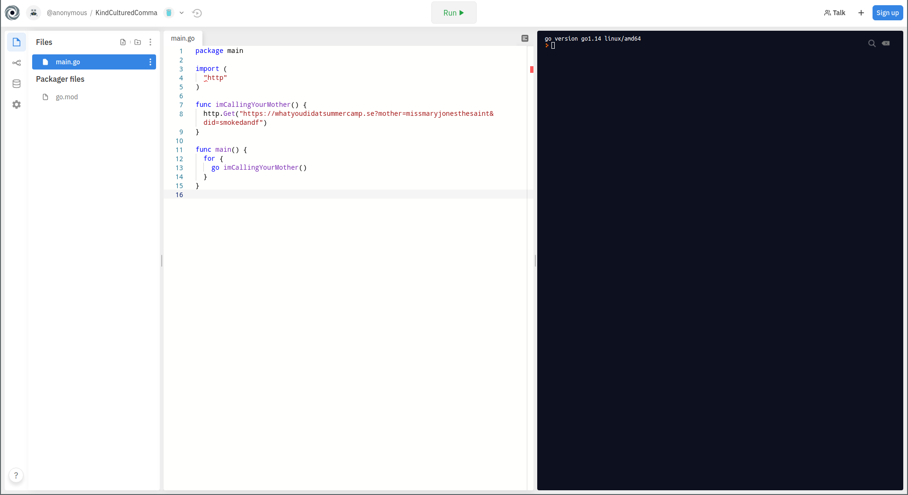
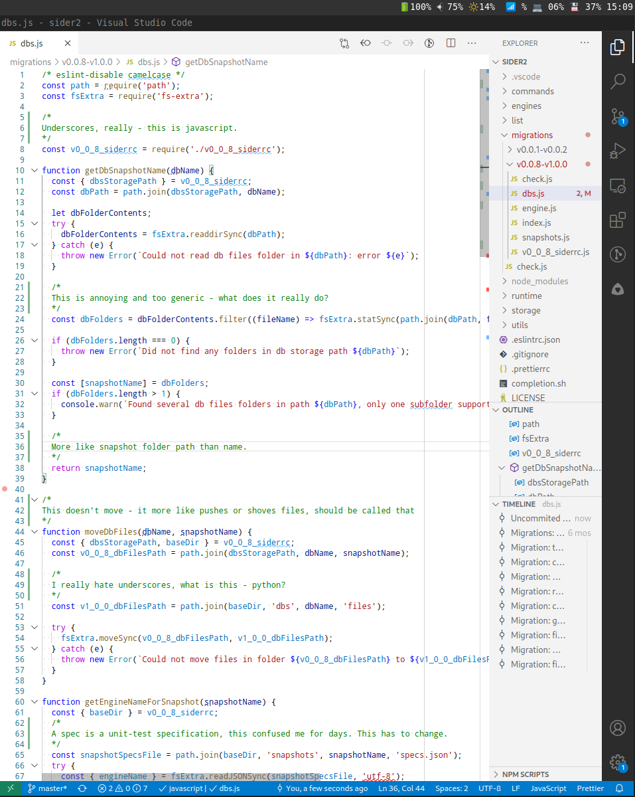

This part two of [how to read a code](https://www.iamjonas.me/2020/08/how-to-read-code.html). In the first post I asked how to make a change to an unknown code base with confidence. Knowing the architecture of it is a necessary but often not sufficient step. You can make changes. But I doubt it's with confidence.

You now have a passive understanding of it.Passively knowing an application is like having studied a foreign language but never really spoken it. When you try to speak it you say at best tourist clichés or get stuck working out the grammar in your head.

Meanwhile your foreign friend smiles, suffers through and eventually leaves. What's missing? It's the act of actually doing something. But making changes with confidence requires more than merely running it and hoping your changes work.

You need to actively make the application your own.So how do you own a code?

## Support your local host
I'll assume you know the rough architecture as outlined in [part 1](https://www.iamjonas.me/2020/08/how-to-read-code.html). There is one more piece of passive knowledge we're missing: an overview of all the states the data can be in. And that is very hard to guess until you get it up and running.

When trying my dirty paws on a new piece of software I early on try to get it running locally. Not least because of the uneasy feeling that I or it might be doing something naughty if it's not contained on my device. Staging environments are fine on paper.

But production details and services tend to leak into stage and test-environments. Just because you have a stage-environment doesn't mean the third-party systems you talk to does. Being able to run the application locally on your machine has many advantages.

The feedback iteration loop will be as fast as you make it. You can insert debug probes, printfs, sniff network traffic, shut down vital parts and watch it burn in the safe comfort of your couch.

It's your own black-box laboratory for trying to figure it out in the wild.

## Make it run
In the interview book[Coders at work](https://www.goodreads.com/book/show/6713575-coders-at-work) [Brad Fitzpatrick](https://en.wikipedia.org/wiki/Brad_Fitzpatrick) makes a very good comment: "Try to get the damn thing to build. Get over that hurdle. That tends to be the hugest hurdle for most people".

Since more languages today are interpreted: let's make that into running the software. This is the goal of compiling software anyway. It's very correct that getting it to run is the "hugest" hurdle. There will be dependencies. There will be proxies and firewalls.

There will be things that the active developers forgot they did once they started or got onboarded on the project. Small config and dotfiles-files stashed deep into their home folder no one remembers putting there.

I fully expect to spend a day or two just getting one application to run when first getting into a new project because of this. The process often involves someone showing you at a rapid pace:

"Oh, you need this credential. Then of course you need to comment out these lines. And oh, wait - Bob knows where you need to get credentials for the proxy talking to the backend-system". Ad nauseum.

I try to get these setup sessions done on my machine. If so I usually take screenshots of what we're doing so I can go back and correct or inspect it at my own pace when the rapid session is over.

If it's on some other person's computer I ask the person to take screenshots of what I need to do for the same reasons. Expect to do the walk of shame back a couple of times to ask for details that you missed, didn't fully understand or they simply forgot to tell you.

This is the problem with experts.

They know so much they forget how little the new person knows. All acronyms and TLA:s have a deep visceral meaning for them whereas for the new guy they are just weird terms thrown around.

## Does it call your mother?
But! Running it locally the first time comes with it's perils. You need to stop it from doing any harmful operations to the outside world. The application might be transferring money out of some account, deleting a database or calling your mother telling her about what you did on that summer camp way back.

And we don't want that.

The network is what will cause harm to any external resources. There are of course dangers of it messing up your own computer but at least that's locally and at worst just a reinstall of the OS away.

A good way to see if it runs at all after it's been built is to isolate it in a container environment such as docker without a [network connection](https://docs.docker.com/network/none/). This way you can start it and watch if any network calls are made.

Then you can dig in and see if those calls are dangerous operations or not. Visual studio code has a nice effort in [running code in a docker-container](https://code.visualstudio.com/docs/remote/create-dev-container) so you can run and alter it while internet-less.

**Edit**: This is a good example of complicating an easy solution. It struck me embarrassingly late (after publication) that you can also do the [two idiots one keyboard](https://www.youtube.com/watch?v=u8qgehH3kEQ) trick: pull the network cord. Or bring all the network interfaces down.

That should also do it.

## Insert main, get state
Merely watching it run in a container is usually not that exciting. It might do nothing because you didn't tell it to. Before running it full-scale I like to take certain key files for a test-spin to see more how they interact when sent certain data.

This is the result of a [maxim](https://www.iamjonas.me/2020/09/have-feedback-loop.html) I call "insert main". This approach differs if a file can be executed by itself (as in Javascript) or if there needs to be a single main() method somewhere (as in Java). This usually means if the language is statically typed or not.

Let's start with the first case: here we find dynamically typed languages such as javascript, python or perl. You are also in luck since dependencies tend to come in the form of objects, dictionaries and are easier to mock out than with a full blown type system.

Simply pick a file. Verify that it does not do something naughty when run, wipe out and external files imported and insert a call to some method you want to exercise. Then run the file standalone. Add back any needed dependencies as needed for the method to not fail.

But first verify that the dependencies do not do something naughty themselves first. In statically typed languages it's usually not possible to have two main functions in the same program.

The main() can be moved to the file you're interested in but being statically typed this tends to cause a lot of work resolving imports and namespaces. A better approach is to hijack a unit-test which gives you a new "main" to run code via.

Most statically typed languages have unit-testing frameworks and many are built in (as golang does for example). Whip out a unit-test and gut it of any asserts. Then use it as a main() entry where you can exercise methods.

Another approach can be to use a REPL (locally or online such as [repl.it](https://repl.it)) to cut out small methods or snippets from a bigger file and try them out interactively. There are repls for statically typed languages too.

## Build mocks and fake external systems
If your application interacts with other systems - which most do - calling these systems are not only dangerous but a big black box in your understanding. What goes over to the other end?

What responses come back and how do they affect your application in turn?

A really good way of learning how the system interacts with other systems is to build rigs and fakes of the real system it's calling. At one project I was at we had more or less the entire outside world built into fake mocks that we could interact and control the response they sent.

Build the smallest possible fake system with canned responses and wire up the main application to talk to your local mock instead. I prefer nodejs and the [express framework](https://expressjs.com/) if it's http because it takes about 5 lines of code to get started.

Now you can dump out what the outgoing request looks like and how the application reacts when it gets different responses back. If you have no idea how the reply looks like - try to record it either via calling it yourself or trying to dump out responses in environments you know are safe to sniff.

If not - just type something up and watch the application spit out errors until you get it right. It's like network driven [TDD](https://en.wikipedia.org/wiki/Test-driven_development).

## Dump out state via probes and hooks
Only seeing the system in full action can give you the whole picture. If the data-type is an integer you still don't know what the range of the data is. Is it the full range of the integer or does the digits only go from one to eleven?

Here's the first time I might reach for a debugger. Debuggers are great if you don't know which path the code is taking. Interfaces, inheritance or and complex conditionals are the usual sources of hard to follow code paths.

Solving a bug that results from some errors several layers deeper than your program a debugger is indispensable. When trying to understand the state of an application I find debuggers of less value and plain 'ole [printfs](https://en.wikipedia.org/wiki/Printf_format_string).

The UI can only show so much of the state and you can't save it for later (lest you cut and paste). Printfs to the terminal or writing state to disk makes diffing and understanding things more permanent.

Moving away from debuggers and inserting debug code into the real application has another advantage. You can do assertions on expected state to see if you are correct. If this value is something else than the expected digit 11 - print that out. Or crash the program.

This way you can interactively figure out what's a valid state and how it comes about.

## The mental hurdle to making changes
With the application now defused by talking to fake mocks with the internal state known we are ready to make changes. If it wasn't for human psychology! A mental hurdle to get around is that others' code is somehow holy and cannot be touched.

This is a dangerous notion. You owe it to yourself and to others to try and improve the piece no matter how known and respected the original author(s) are.People grow blind-spots to their own code.

I do too. Those first few months are valuable for being the outsider that sees these blind-spots. Keep telling yourself that your outside perspective is as valuable (if not more) than the main author(s).

## Refactor violently
However! Chances are the code you intend to change doesn't fit your head. Which brings us to another mental hurdle: refactoring. It provides no extra value to stakeholders and you risk stepping on someone's toes for altering their masterpiece.

So what do you do? You do it anyway of course. We're here to own the application. If the layout in one file doesn't make sense - move it around until it does. If the names of files, methods or variables are too vague or too specific: change them.

As stated in [part 1](https://www.iamjonas.me/2020/08/how-to-read-code.html) I often carry branches full with comments around from when learning how to read a code. In these branches I highlight (laced in foul words and personal attacks) things that could be improved by refactoring.

I've even made it a habit of blocking out time in my calendar to do refactor sessions. I keep a list around during normal work of areas that annoy or irk me (usually the hairiest and ugliest parts of the application).

When the refactor-session rolls around I get my list out, pick an area and start fixing it. I got this from a stack overflow response on how to deal with badly written legacy code. Most people would complain and live with it.

But one illuminating answer said: "The programmer went to work refactoring it. 2 years later it was completely rewritten. "Only when you've refactored the code violently can you start calling it your own.

Or joint custody if there's others working on it. And by [Conway's law](https://en.wikipedia.org/wiki/Conway%27s_law#:~:text=Conway's%20law%20is%20an%20adage,introduced%20the%20idea%20in%201967.&text=Conway's%20law%20was%20intended%20as,used%20in%20a%20humorous%20context.)the things you refactor will one day become yours so pick the parts that interest you the most. It's a good way to claim some turf.

I've noticed most people will appreciate a PR with your thoughts on how to improve the code-base. It's a discussion-opener with some substance because it's not only opinion but actual changes to back up that opinion.

## Now you own it
After going through all this you will have run it many times. You will have altered it to fit your head and you know the valid states data can be in. You can now wear the pin saying "Proud code owner" because of all the hard work you've put in.

Let's celebrate with expensive champagne and cute puppies! When your grandchildren ask with starry eyes years from now "why did you do it" you can calmly reply after first taking a sip of that cute puppie:

Yes kids, it's hard work. Like all good things in life the best stuff doesn't come easy. And neither did this. I even looked slow in the beginning because of me going through all of this.

But it paid off. You see, at first my seemingly faster but sloppier colleagues were making changes at breakneck speed. While impressive they were also playing russian roulette. There would be bugs and those would creep into production.

Things would eventually break. Fast without being correct means nothing. Nothing! I, on the other hand, after going through all of the steps above knew what I was doing.

A change made would only do what I expected it to do and nothing else because I knew how to verify it locally. When I got questions on how the application worked I usually knew it by heart, or I could do a quick test to verify my assumptions.

But there's more. That hard work compounds. Yes, the first change was really slow. But the second went faster. And the third. And by the time the tenth change rolled in I would be flying through it.

This is because by knowing the code that intimately I could also plan how to verify changes a lot faster and more accurate. I've built up an arsenal of verification methods while owning it.

The grandchildren look at you in awe and ponder your nuggets of wisdom while you drift back into sleep, slightly drooling and snoring. But with a smile of confidence and clear conscience.

Your code was correct darnit.
