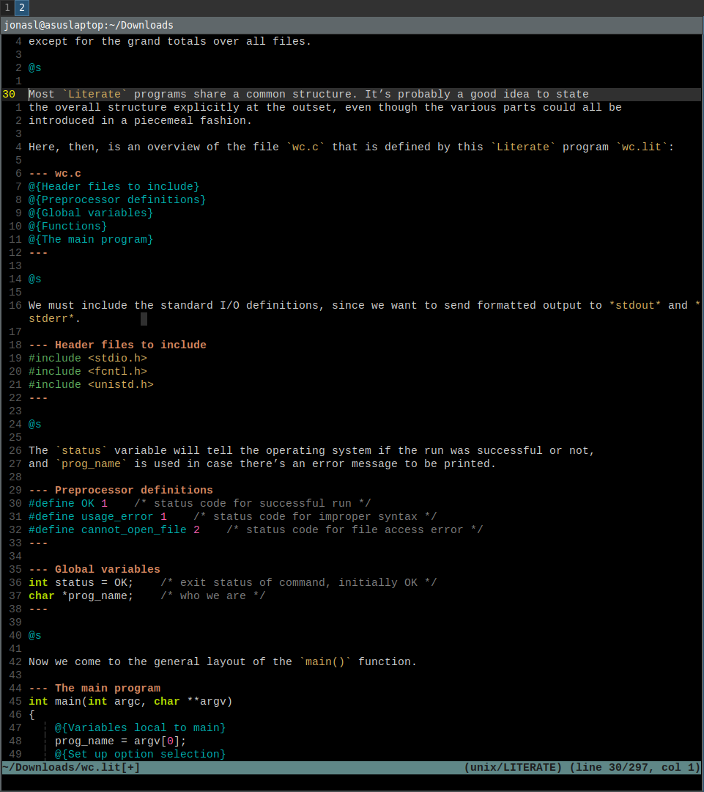
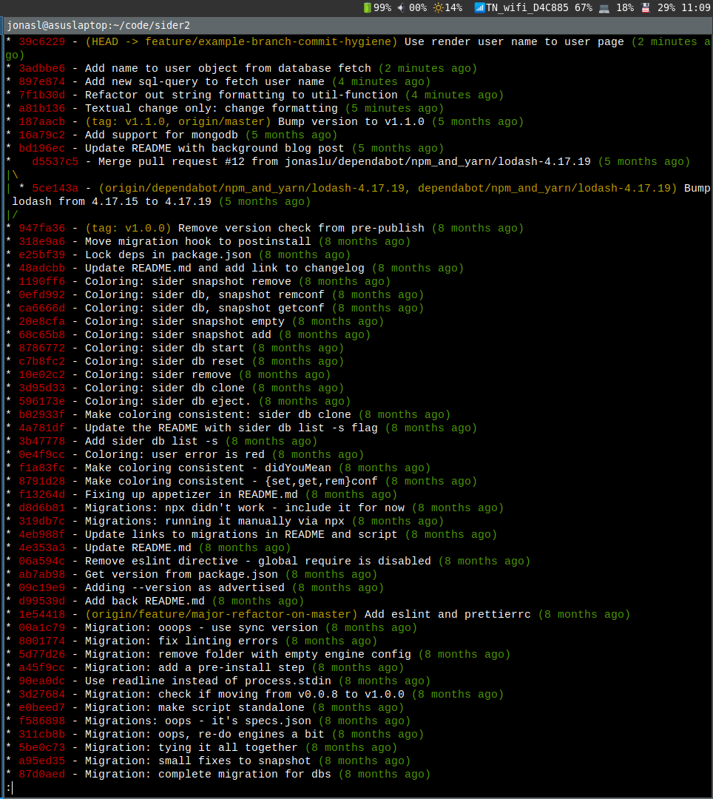
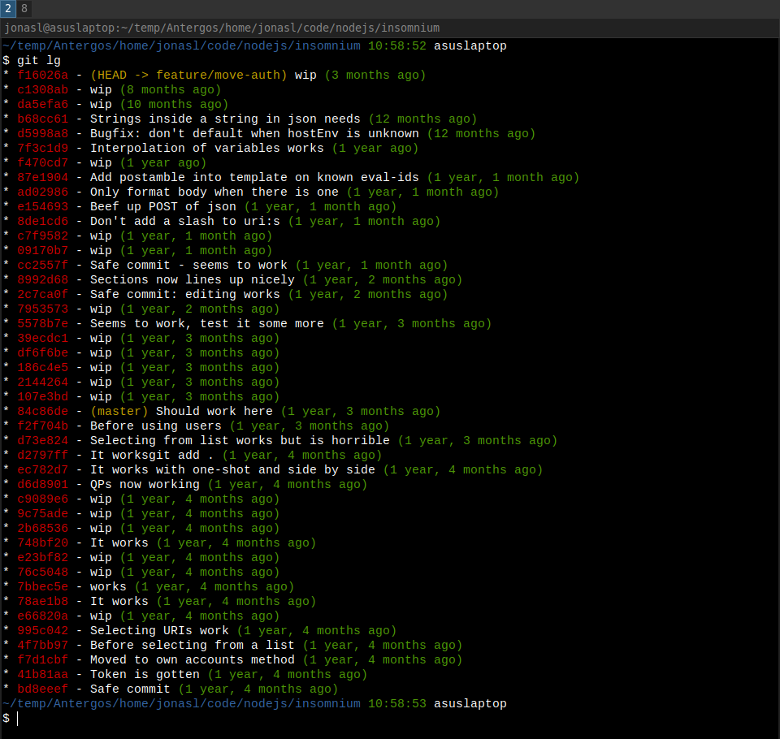

We all do it. Up to many times a day and yet it's rare that I meet someone that has given it a second thought. No, it's not secretly snacking chocolate from your top office drawer.

It's how you write and structure your commits. Possibly while snacking chocolate.

## Literate programming
I've been intrigued by the idea of [literate programming](https://en.wikipedia.org/wiki/Literate_programming) ever since I first stumbled upon it. The short gist is this: you write in regular prose what you are doing and then intersperse that with code snippets.

An external program then assembles and compiles the code snippets into a runnable program. It can also spit out the prose as documentation. It's like code with comments only the importance is reversed.

The comments are the main attraction and the code is secondary. It's a lot more written prose than code. Here's the original TeX source code as an [example](http://tug.org/texlive/devsrc/Build/source/texk/web2c/tex.web). Without highlighting it's a bit confusing.

Here's a more modern literate program in vim as contrast:



In an interview in [coders at work](https://www.goodreads.com/book/show/6713575-coders-at-work) it's inventor Donald Knuth explains his enthusiasm for it: "First rule: understand your audience and write for that audience. Second rule: say everything twice in complementary ways so the reader has a chance to put the ideas into their brain in ways that reinforce each other".

Expanding on the first rule: "I don't want to present it in a way that the compiler wants to see it. I present it in the form I think is easiest for the reader to understand". And the second rule: "So literate programming is based on the idea that the best way to communicate is to say things both informally and formally that are related".

The link between natural language and code has been a slow and rewarding discovery. [How to read a code](https://www.iamjonas.me/2020/08/how-to-read-code.html) is based on transforming code back into prose using your own words. It's reverse engineering literate programming.

If I can in my own words express what the program does, the code and it's workings becomes much more obvious. Or as stated earlier: expressing a concept in two complementary ways - both your own and the compiler's terms reinforces understanding.

## Atomic commits
You have a brain. It has a limit. It's super-sad. But what can you do? I've grudgingly accepted the fact that my brain won't hold 10 000 lines of code in my head all at once. It's more like 2+-4 depending on the amount of sleep gotten that night.

To help me accept my super-sad limited brain I've used the concept of atomic commits for many years. It's been well [documented by others enough](https://www.google.com/search?q=atomic+comits) for me to continue and mansplain it to you anyway:

An atomic commit is the minimal and accurate solution to one agreed problem. The keywords here are minimal, accurate and one. Minimal as in you cannot make the patch any smaller without failing to solve the problem.

Accurate as in it correctly solves the agreed problem. And one as in you solve one and only one problem per commit. A large problem will end up in many small commits, each chipping away at some subset of the larger problem until the large problem is solved.

The branch should ideally build and be ready to run at each commit unless there are really good reasons for leaving the branch broken between commits.



The canonical example of how to not do atomic commits is to format the code and at the same time slip in a functional change. In this case you are solving two problems with one commit.

One is to change formatting and the other is the functional change. These two should be separate. Why is this important? This is where your brain comes into play. It can only hold so many things at a time. 

Getting something right is hard but not impossible when dealing with a few moving parts. You can through testing and thinking reassure yourself that it's a 99% likelihood of it doing what you want.
When there's many moving parts - in other words not a minimal solution anymore - the accurate and one part of the same sentence will not be true either.

## Atomic literate commits
So what do atomic commits have to do with literate programming? The commit message of course silly. Combining an atomic commit with the help of literate programming simplifies dealing with your limited brainpower.

You use language to show yourself, your mother and fellow programmers that you know what you're doing. You use atomic commits to limit the number of moving parts so it's actually possible for you to know what you're doing.

The commit message will be your blank canvas where you in prose write in ways that reinforce what the code in the commit does. If you've got your solution down it will be easy.

Here's a not so contrived example with the commit message first:
``` text
Read files of data concurrently
In order to improve speed we read the 10 data-files concurrently
and store their contents in a string slice (array).
We need to pass the integer into the go function as an
argument to avoid the go function closing over the same
variable and reading the same value in all go-functions.

It's safe to concurrently operate on the slice (array)
since each go-routine is only manipulating one index of the slice.

If any of the data-files are missing blow up by calling panic() with
the error since we cannot proceed without that data.
```

And then the code:

```go
var fileContents \[\]string = make(\[\]string, 10)

for i := 0; i < 10; i++ {
  go func(i int) {
    contents, err := ioutil.ReadFile("./data" + strconv.Itoa(i) + ".json")
    if err != nil {
      panic(err)
    }

    fileContents\[i\] = string(contents)
  }(i)
}
```

Even if you don't know the language the code is written in I bet it makes a lot more sense by reading what it's supposed to do in plain text first.

With atomic literate commits you are also honoring the [principle of least astonishment](https://en.wikipedia.org/wiki/Principle_of_least_astonishment). The principle states that the result of applying this patch should be obvious, consistent and predictable.

If your message agrees with the code and the code is minimal, accurate and solves one problem there will be little astonishment and more trust in what you do. Here we again use natural language as a help to understand what code is supposed to do. 

Since the commit message is in git and not your code it won't rot either. It will be forever true since the patch and the commit message are contained together.

## Shitty draft first branch
In book writing circles there's a well known mantra called "[shitty draft first](https://wrd.as.uky.edu/sites/default/files/1-Shitty%20First%20Drafts.pdf)". It's getting something, anything out on paper in order to get over that hurdle of the blank page staring back at you.

Once you've completed the shitty draft first you can return later and start editing and writing for real this time since there is something to start from. In the real world outside the ivory tower of iamjonas.me things do not happen in neat orderly commits with one focus.

They often happen randomly because you can't solve a problem neatly until you've first solved the problem. Which is not neat. Unless it's a clear cut bug with a very well known before and after state I'll cheat.

I'll use [overview-mode](https://www.iamjonas.me/2020/06/overview-mode.html) to have some way of attacking the problem but even then things do not go in a clear orderly way.

A more common scenario is this real-world example git-branch:



The commits are small but very often not atomic nor literate. I'll often do small work in progress (wip) commits just to save the code in a known working state. Doing this makes me backtrack less to find out what I've destroyed or if I need to go a separate path.

These commit messages are nothing like literate programming. They might contain useful messages but mostly it's "before doing X" or "X works!!" combined with cursing. You're feeling stuff out so it's ok to write such messages. This is my shitty draft first branch.

Once the problem is solved or very sure it's solvable we enter the next phase.

## 1984
So now we're stuck with a shitty draft first branch and nowhere is the commits atomic or literate. What now Mr. Smartypants?

Create a copy of your shitty draft first branch (so you always can go back and restart). Then give the shitty draft first branch a cold hard look. Can you massage the commits as they are into an atomic literate masterpiece?

That usually means git rebase -i moving commits around in order and then using squash and fixup. Most of the time I cannot because they're not properly sliced. One commit should maybe be sliced into two separate, while three others should be one commit.

So what I'll do is git reset --soft the whole thing back to where I branched out. This way you have all the work you've done as staged files. Then look through all of the changes and start thinking on how to make them atomic and literate.

The leading question: is what's the smallest chunk that takes this code from one working state to the next desirable state that I can easily explain? It takes some fiddling and possibly going back to a clean slate, but is well worth the extra work.

When it comes to crafting messages you'll find that the literate part and the atomic part will play off each other. It will be easy to write up in prose what and why it's done this way.

If something is hard to write in prose it's a clear sign that you do not yet know it well enough to create a commit out of it. Go back to the code and think more on why you did it this way.

This is usually where I find mistakes and bugs hiding.

## What's in it for you?
A wonderful but often useless way of doing root cause analysis is [git bisect](https://git-scm.com/docs/git-bisect). When bisecting we do an interval-halving to find a commit introducing the error. If that commit message says "Fixed bug" and is a mix of 500+ lines of code long we have gained nothing from using git.

Same with git blame. It's often fun to see who f-ed up (it's always me, half a year ago) but unless that person crafted an atomic and well written commit-message you're none the wiser on what the change was supposed to do.

If you don't know the how and why you can inadvertently make things worse. Code reviews become infinitely easier. The reviewer can quickly understand what problem you were solving and how you solved it by using the commit message as a top-down introduction.

Then if the code and the message coincides that's a clear sign of quality and a LGTM. If they do not then you can be 99% sure the author did not know what they were doing and send it back not wasting precious time.

And with the risk of sounding like a broken record: Being accurate is the most important thing for a programmer. If your stuff doesn't work as intended everything else goes out the window.

If on the other hand your prose in the commit message and the code tells the same story you've just explained yourself in two ways that reinforce each other.

That's something only a person who truly knows what they are doing can pull off more than once. And I'll be impressed.

Possibly while snacking chocolate from my top office drawer.

## Appendix: a tour of 100 famous repos
The number of times I've explained the concept, and the number of times I've looked at git-logs tells me this is not widely practiced nor popular. Writing this post gave me the excuse to actually do some research on the literacy and atomicity of the most popular github repos out there.

Head over to the sister-repo of this post where I do the research on literacy and atomicity find out if the 100 most popular github repos do practice literate atomic commits:

[https://github.com/jonaslu/spad-mats/blob/feature/literacy-and-atomicity/RESULT.md](https://github.com/jonaslu/spad-mats/blob/feature/literacy-and-atomicity/RESULT.md)
