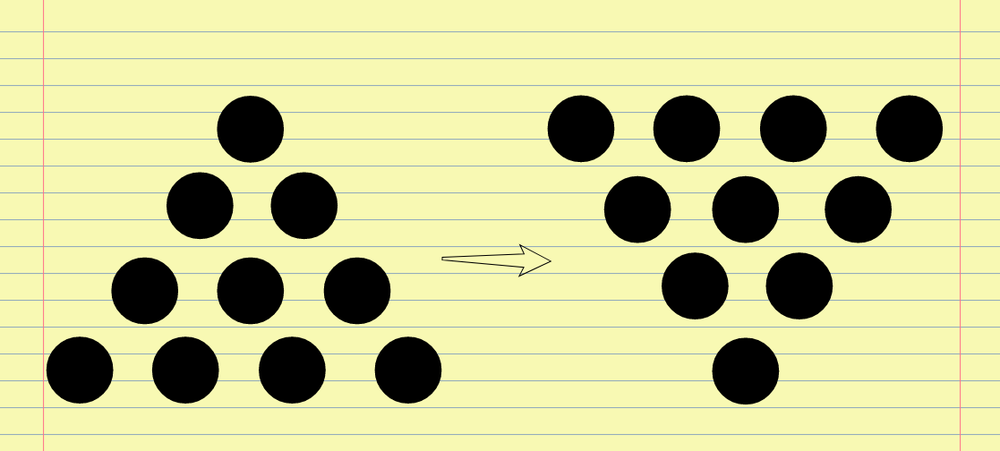
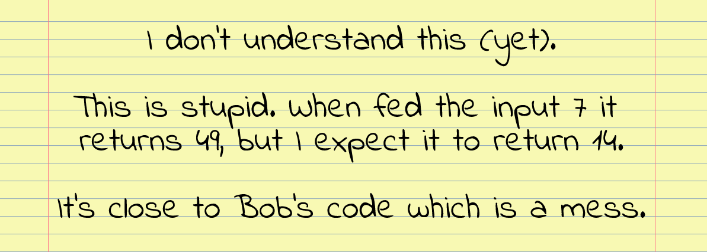
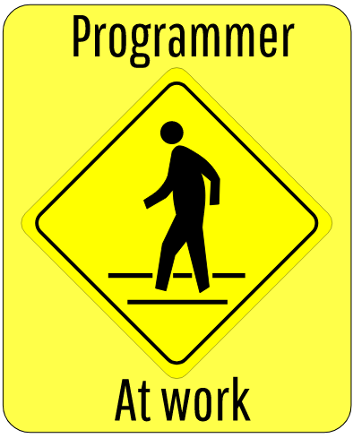

In part one we looked at stuff you don't know (yet). This post we'll look at stuff we don't understand (yet). The first thing to do is to say to yourself without flinching "I know the basics of this". If you flinch you're out of your depth and on your way to wasting plenty of time.

[Part I](https://www.iamjonas.me/2021/06/getting-unstuck.html) deals with that.

## The second shade of stuck
So here we are once again. Stuck. But this time it's not because we haven't read up on the basics enough. No sir. We know the basics well. This time it's because our view of how the program should work and how it actually works is off.

You think it should behave in a certain way but it does not. This is caused by you having a false view of what is happening. Your mental model of the program is incomplete. This makes getting unstuck harder since we can no longer pour over manuals.

We have to ourselves dig out context enough to correct the mental model.

## The a-ha moment
You must have experienced it by now: the a-ha moment where it clicks in place and the solution is obvious. It's called a flash of insight for a good reason. Brain scans [have shown](https://brainworldmagazine.com/aha-moment-science-behind-creative-insight/) that the right side of the brain lights up with gamma waves about ⅓ of a second before you actually arrive at the solution.

Gamma waves are a sign of new neural pathways forming in your brain. A classical example of this is the coin insight problem. The coins are arranged in a pyramid as shown in the image and your mission Jim, should you choose to accept it, is to invert the triangle moving three coins only.

The usual workflow is that you try some trivial movements that don't work. You try some more with increasing frustration and still fail. Eventually you curse, call it a stupid game, walk away and then some minutes from there it hits you from seemingly out of nowhere.

You run back and verify the solution. How trivial! Why could you not have solved it directly? How did that happen? All the information you needed was there. You just need to see it in a new way. This is what you will be doing in a I don't understand this (yet) situation.

Let's dig into how we can systematically create opportunities for insight to happen.

## Admit it
As in the first part of this series, the first thing you should do is admit it out loud: "I do not understand this (yet)". Dumb as it may feel I've found that doing this gets me out of the stack overflow-copy paste-quick fix mode of programming.

Even if stack overflow solves it for me, how do I know it actually works? To get into the right mental state label it a problem worthy of attention. Like a good tennis match or the lint in your belly button this problem deserves time.

## First how then why
First off we'll assume you know **how** it happens and you should be able to reproduce it locally. Thankfully it's quite rare to have no clue on how. Best tools are to ask whoever brought it up. If you yourself notice it backtrack and pay close attention to the steps leading up to the bug happening.

If you still have no clue, build in more logs and probes collecting data until you can get a handle on how it happens enough to reproduce it. Then after how comes **why** it is happening. You cannot solve it unless you know why it works a certain way.

You should be able in simple words to describe why it is like this and why your patch makes it do that instead.

If not, there is trouble ahead as you don't fully grasp the problem yet.

## Write it out
As a first stop: write out **how** it happens and what you **expect** it to do. A contrived example: "I don't understand this (yet). When the routine is fed input X it should return Y but it's returning Z". Getting it out in words forces me to be more clear on things.

I can also curse and indulge in name calling without restrain.

Then write out all the facts you know so far. Also write out what you know you don't know yet. Then read it out loud to yourself. It's amazing how far you can get by doing this alone.

An example might be: I don't understand this (yet). Program crashes on line 47 in the src/pkg/time/DateUtil.go file, but only seems to happen every 7th time with the same input. It happens with the number 43. I don't know if negative numbers or zero also cause it to fail.

## Debug gently
From here most (including my lazy pre-this-article self) reach for the debugger. However the debugger is a double-edged sword for the reason that it can go into far too much detail and lose sight of the original problem.

It's the same reason I'm doing [overview mode](https://www.iamjonas.me/2020/06/overview-mode.html) on paper instead of in an editor: It's doing something rather than thinking it through first. And it's very seductive to chase a hypothesis you know is right instead of stepping back and trying to think of different hypotheses.

Rob Pike of golang fame noted that while he reached for the debugger first thing, Ken Thompson would ignore what Rob was doing and just [stand and think](https://www.informit.com/articles/article.aspx?p=1941206).

Then after a while he'd say: "I know what's wrong" and very often be right. What Ken was doing was constructing a mental model of the program. When something broke it was an error in that model. He'd think of how that error might happen or where the code might not satisfy the model.

This should be your first stop when trying to solve a problem. You might not have to break out a debugger at all. Give it a good think on how it might happen given what you already know.

## Research it
Since you are still reading this thinking of how the error might happen wasn't enough. Don't worry, there's more. The next step is to research the problem.

The word research is key as we're not trying to solve it (yet). We're merely gathering more facts and poking at the problem. This takes the pressure off answering it and paradoxically brings us much closer to a solution.

I do this in the form of: happens here, doesn't happen there and asking a lot of detailed and pointed questions. What's the context on line 47? What happens the seventh time with the same input? What's going on before line 47? What's after? What's the call-stack when we're at that line?

After researching it for some time we might stumble upon why it happens. The key once again is to not try and solve it just yet. Simply poke at it. Gather facts on where and what's going on around it.

Use the debugger sparingly if at all. See if you can use more exotic ways like printfs, dump out data via files, assertions etc just for the sake of getting a wider range of troubleshooting techniques should you find yourself without a debugger someday.

## Seriously, research it
If you still come up empty handed, do not despair! A good way of continued research is to try and create a minimal example outside of the parent codebase where the error still happens. If you strip away the program and run only the file where it's happening - does it still happen?

Could you build a minimal prototype exhibiting the problem? Trying to set up state to trigger the error is very enlightening. Yet another good way of researching it is to type in the file where the error happens in a blank editor line by line from memory.

It's the old [active recall effect](https://en.wikipedia.org/wiki/Active_recall) at play again. This way you're forced to think much more deeply on why things are the way they are. There's a good chance you solve it while typing it back because it becomes obvious what's causing it.

## Have some theories
But since you're reading this far, doing the research wasn't enough to crack it. That's ok. This means you've got a complex problem on your hands. Rejoice, possibly with popcorn! Now it's time to try and formulate some hypotheses on why it might be happening. This step is done only after extensive research as we need facts to generate theories.

An example of a theory is: "I think it's because the loop index is off by one". Then we can either prove or disprove this and other theories one by one. Here is again the siren song of assuming things too fast.

You latch on to some theory that seems likely and try very hard to look for evidence to support that theory. At every stage of the journey remind yourself to be open to being wrong. A good acid test for a theory is "what proof do I have that it is true?" and "what would cause this theory to be false?".

When trying to prove or disprove the debugger is of great use as it becomes a verification tool rather than a window into unrelated complexity. Minimal prototypes or experiments are also good for validating or disproving a theory.

## Einstellung effect
The annoying thing with insight into a confusing problem is that it cannot be forced. It can only be invited. Trying the trivial things and getting frustrated is just part of the ground work that needs to be put in.

The problem is that we get caught in the same mental rut. You need to take deliberate action to step out of that rut. In Barara Oakleys excellent book [A mind for numbers](https://barbaraoakley.com/books/a-mind-for-numbers/) this is called the einstellung effect. This is when you're so caught in old thought patterns that you can't step back enough to see the bigger picture.

According to the book you have two modes of thinking: the focused and the diffuse mode. The focused mode is just what it sounds like - deliberate step by step calculations. It's what you do when you try the obvious solutions or step lines in a debugger.

This is contrasted with the diffuse mode where you're not directly focused on the problem. Often you're doing some chore like the dishes or showering. You are thinking of the unsolved problem but it feels distant. It's that dreamy big picture noodling that you achieve when you step away from the desk for a while. Then it hits you.

This is your diffuse mode of thinking at play. It connects parts in your head that you cannot when you're focused on the problem. But through the obvious theories and work you must go. They need to be brought out and discarded for the sake of building neural traces that your diffuse mode of thinking can connect in ways you can't when focused.

Or in short: study hard so you have enough material for your diffused mode to work with. Then break and let it do some work for you.

## Move your ass
The classic places for letting the diffuse mode do it's work are the three b:s - bed, bath and bus. That's all great, but that means you cannot solve it until after work (unless you work from a bus, bath or bed). But there's a much more accessible way that many great scientists have leveraged: walking.

This is why I use a [walk-o-doro](https://www.iamjonas.me/2014/12/the-walk-o-doro-1ing-your-creativity.html) heavily in my workflow. Set a timer for 10-25 minutes. When it goes off, get up and walk. When it comes to getting unstuck I don't have the classic problem of focusing. I'm having trouble detaching from the problem long enough.

I can't even count the number of times simply getting up and walking around gently holding the problem in my head has helped. Try in a slow, almost dreamy way to generate as many questions as possible while walking. "What did I just read?", "What if it's not this but that?", "What if is isn't Bob's code but mine?".

The more puzzled you are the more you have to enforce breaks away from your desk to let your diffuse mind sort things out.

## Change location
Here's where it gets even more trippy. The location might hold you back. Yes, it's a great excuse when a deadline approaches, but I've found that locations do influence your thought patterns.

One place can be strongly associated with one way of thinking. Or at least it feels burnt out. Simply by moving to a new place there's a feeling of starting over. Make it a point to switch locations at the first hint of frustration or slowing down.

Use an empty conference or meeting room. Walk into the cafeteria after lunch-hours. Go to a different floor. Ask if a colleague will switch places with you. Get out of the building you work in if you can.

Anything to change where you come up with theories.

## Have some patience
You can get better at solving problems. The sad thing is that it's rarely talked about and even less teached. My first exposure was Rich Hickey's talk [Hammock driven development](https://www.youtube.com/watch?v=f84n5oFoZBc). It's a good talk and I highly recommend it.

The main gist is having an open mind and spending lots of time on researching the problem rather than trying to solve it. As humans we want to be right. And to be right straight away. This leads to getting attached to some theory and then trying to find evidence for it.

Which brings us right to the last crucial component of problem solving: patience. The diffuse mode shuts down when we're stressed. There's no time for dreamy big picture thinking during crunch time. Being patient and staying calm is not merely a nice new-age thing, but necessary for progress.

That patience and calm should come from the fact that the process above is systematic. For each theory generated, write down why it failed in the description of your problem.

Then break and come back for another round. You're making incremental progress and your growing problem description is evidence to anyone who thinks you're slacking off. Which is what you periodically should be doing.

