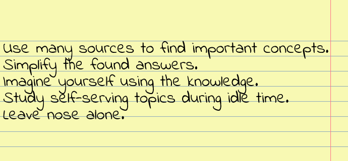

In the book [Ultralearning](https://www.scotthyoung.com/blog/ultralearning/) Scott H Young argues that the difference between a great programmer and mediocre programmer is not the ability to solve problems. Both can often get the job done. But the great programmer knows a dozen or more ways to solve the problem and can apply the most effective solution for the case at hand.

Mediocre sounds like a put down and we've all been there so let's call that person less knowledgeable instead. The less knowledgeable programmer only knows a few or even one solution and deploys that solution unaware that there are better ways.

I can look it up if I need to, you might think. The problem is how do you look up something you don't even know exists? These are the unknown unknowns. Things you don't know you don't know. And those are indeed hard to look up. 

To become better you need to know what's out there. You need to turn the unknown unknowns into known unknowns.

## Learning deep vs broad
In the previous posts [how to read a code](https://www.iamjonas.me/2020/08/how-to-read-code.html) and [I don't understand this yet](https://www.iamjonas.me/2021/08/i-dont-understand-this-yet.html) we looked at learning one subject deeply. Both use a top-down first approach where you scan for core concepts that you can link more information onto while bottom-up:ing.

Things change when we're dealing with a huge field of information. We need to focus on a limited set of concepts and then move on. There's simply no time nor would it be useful to know every little detail since it might never relate what you're doing.

What we will be doing is placing a bet. We're betting on our ability to select the most important concepts for future use. If we're skilled and a bit lucky we've focused on the correct concepts so we recognize them when faced with a new problem.

Maybe simply knowing that concept is enough to solve the problem. If not then we know where to go and what to read up on.

## Core concepts
When learning a natural language there is a thing called a [frequency list](https://en.wikipedia.org/wiki/Word_list). It contains words sorted by their frequency of occurrence in descending order. This is a really neat thing. Learning the most frequent word in a language allows you to get vital context in a lot of sentences.

Similar to frequency lists in a natural language there are concepts in any software product that the rest of the software builds upon. I'll call them core concepts. Let's use git as an example. Three core concepts are commits, branches and conflicts.

If you know these three core concepts you can proceed with further learning. If you don't then any additional learning will be confusing and painful. Lacking frequency lists for concepts in a software package we can use many sources as an approximation to find our core concepts.

If many articles / blogs / repos mention a concept - it's probably important to know. If one or only a few mention it it's likely less important.

## Syntopical reading
We return once again to the indispensable book [how to read a book](https://en.wikipedia.org/wiki/How_to_Read_a_Book). The fourth level of reading is called syntopical reading. It goes as follows: First you have some subject you'd like to know more about. You then build a bibliography of relevant books on the subject you want to know more about.

Quickly scan all selected books and discard those that did not fit. Then you scan the remaining books again and collect relevant passages to your subject. After that you define a neutral terminology and interpret each author's passage into this neutral terminology.

Then you pose a set of questions that the books must answer. You gather arguments that answer those questions and you highlight any issues or contradictions between authors in an orderly fashion.

To build the bibliography the book recommends using [a syntopicon](https://en.wikipedia.org/wiki/A_Syntopicon). This is a book containing a categorization of existing literature and helps you bootstrap your search for the correct bibliography.

## Modified slightly
I do not know of any syntopicons for software packages and even if there were, they'd be outdated so quickly it's not worth it in the first place. So the good ole search engine will serve as our syntopicon. Search engines need to be directed with questions or we'll get way too many hits.

Thus we need to alter the approach somewhat and start with questions we'd like to answer before we select our sources. The first question you should answer is the obvious "What does X do?" where X is the software you want to know more about.

Try a few alternatively phrased questions like "What is X?" to broaden the number of sources. Open 5-10 links that look relevant to you in new tabs and do a quick inspection of each. Discard any that are obviously irrelevant. Then do another quick inspectional reading of the articles left and collect the relevant passages.

If most of them converge on the same-ish answer you can assume you've found your answer. Now that you know what it is, go back again and this time search for a low number (three is good) of core concepts. Questions such as "How does X work?" and "What are the important parts of X" are good.

Do the same as you did above and collect some relevant passages on each of the core concepts you find.

## Simplify, stupid
We now have a bunch of relevant passages that say the same-ish thing. But in order to truly make it stick in your head and pop up at the right time we need to actively work with it. According to the book we're going to define a neutral terminology, but let's not stop there.

The [Feynman technique](https://en.wikipedia.org/wiki/Feynman_Technique) is a good way to actively process information to make it stick better. [Richard Feynman](https://en.wikipedia.org/wiki/Richard_Feynman) should hopefully not need any introduction. If you're stumped about this guy, go practice finding out who he was by trying out the method above. It's well worth it.

The Feynman technique goes as follows: write down what you know about a subject. Explain it in words simple enough for a 6th grader to understand. Identify any gaps in your knowledge and read up on that again until all of the explanation is dead simple and short.

What I like about this is the elimination of technical jargon, fancy words and hand waving. They're off limits since the audience does not know programming or have deep technical knowledge.

Ignorance hides in such words. You think you know what it means, but in reality you're just parroting back what the last person said. Only when you can say the definition of a word in simple plain language do you have a firm understanding.

Take your relevant passages collected above and compress them with the Feynman-technique. Now you have what a software package does and it's core concepts in simple short language. Good job so far!

Make the information accessible
-------------------------------

When pressure is on we tend to shut down mentally. Our thought patterns narrow and we fall back on instincts and well rehearsed routines. This is bad for remembering things you've learnt about broadly. 

They're less rehearsed than what you use frequently and will be further back in your mind exactly when you need them. In order to mitigate this we are going to make the information we just dug up more accessible by actively trying to come up with questions where the information is the answer.

In doing this we're trying to intercept questions we might later ask under pressure in order to preemptively inject an answer. So with your Feynman-compressed answers above try to the question "When would knowing this be useful?".

Try to envision as many scenarios as possible and write them down. Then try to answer the question "What could I do with this information?" and again envision and write down. Now you've both envisioned situations where something happens to you and where you make something happen with your newly minted nuggets of information.

Hopefully this will make the answer pop up when you need it.

## Learn all the things?
My grandfathers were both hoarders of impressive magnitude. Anything would be put away in some storage reasoning "it might come in handy one day". And a small percentage of everything stored did come in handy. But the rest did not.

There is no shortage of videos, courses, newsletters, hacker news-ish sites so you could spend your day doing nothing but learning broadly. But that way you'd get nothing done. [Information overload](https://en.wikipedia.org/wiki/Information_overload#Early_history) may not be a new thing, but the sources above has made it even more rampant.

My grandfathers would have loved bookmarks and incoming reading-list sites. I've applied a heuristic for years. It centers around the topic I find most interesting. Myself. If I hear or read about something new I'll look at the relation to what I'm doing. If it's highly related I'll check it out as soon as possible with the process above.

If it's weakly related I'll skip unless I hear about it very frequently. This lessens the information overload as I will mostly learn things that are interesting and relevant. I usually let the day-to-day toil drive the incoming things to learn.

I simply trust that if it's important enough it will surface somewhere somehow.

## Use idle time
When does this learning happen? It might sound like a lot of work to go through the steps above. At first it'll be awkward and time consuming but once you get the hang of it it can be done very quickly.

There has to be some moments in your day when you're idling. Compiling, waiting for Bob's code review, a dull meeting, commuting or picking your nose. I'll usually get something like 15 minutes of learning broadly per workday in those moments where I'm idling anyway.

Over time that adds up even though my nose is less clean.

